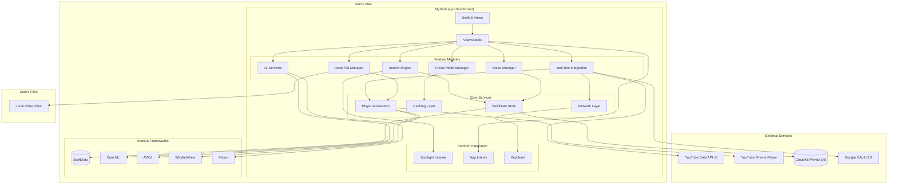
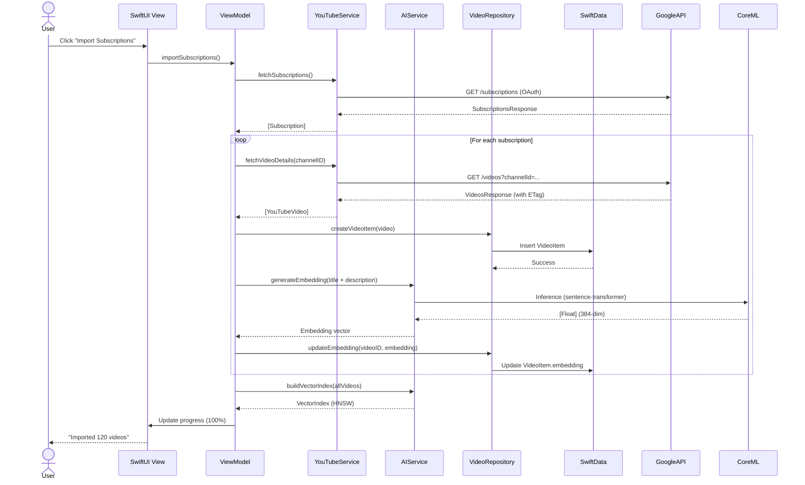
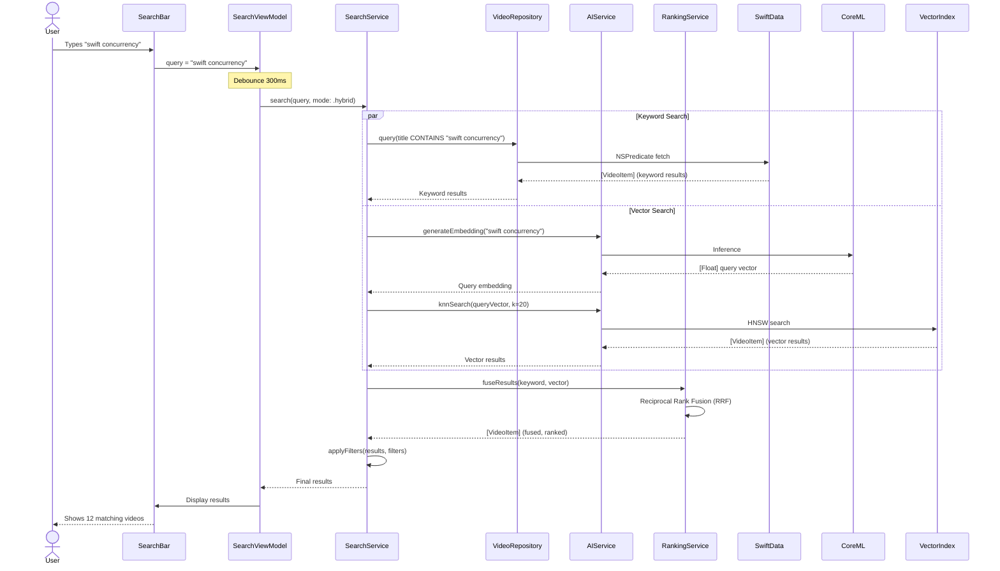
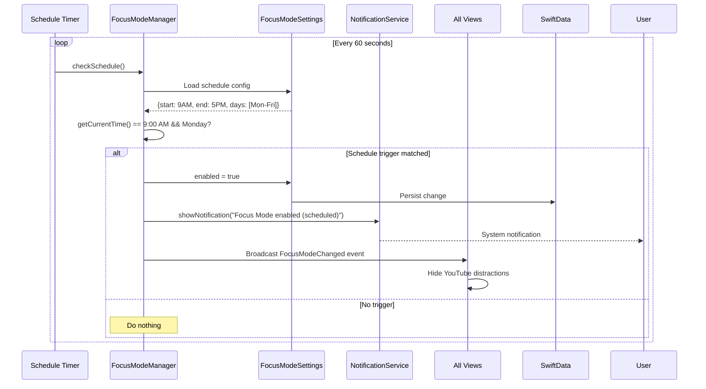

# MyToob Native macOS Architecture Document

## Introduction

This document outlines the complete technical architecture for MyToob, a native macOS application built with SwiftUI that combines YouTube integration (via official APIs) with local video file management and on-device AI-powered organization. This architecture ensures compliance with YouTube Terms of Service, App Store Guidelines, and privacy-first principles while delivering high performance and excellent user experience.

### Project Context

**Project Type:** Greenfield native macOS application (macOS 14.0+, Apple Silicon optimized)

**Architectural Philosophy:**
- **Native-First:** Leverage Apple's frameworks (SwiftUI, SwiftData, Core ML, CloudKit, AVKit) for optimal performance and platform integration
- **Privacy-First:** All AI processing on-device; no external data collection
- **Compliance-First:** Strict adherence to YouTube ToS and App Store Guidelines
- **Single-Process:** Monolithic app architecture (no microservices, no backend servers)
- **Platform-Specific:** macOS-only in MVP (potential iOS/iPadOS companion apps post-MVP)

### Change Log

| Date | Version | Description | Author |
|------|---------|-------------|--------|
| 2025-11-17 | 1.0 | Initial architecture document | BMad Master |

---

## High Level Architecture

### Technical Summary

MyToob is a **single-process native macOS application** built entirely with Apple's first-party frameworks. The architecture follows a **monolithic design** where all components (UI, data persistence, AI processing, networking) run within the same application sandbox. There is **no custom backend server**—the app communicates directly with YouTube's official APIs for metadata retrieval and embeds the YouTube IFrame Player for compliant video playback. Local video files are managed via AVKit with security-scoped bookmarks for sandbox compliance.

**On-device AI processing** using Core ML generates embeddings from video metadata, builds a vector index for semantic search, and performs graph-based clustering—all without sending data to external servers. SwiftData provides the persistence layer with optional CloudKit sync for cross-device data synchronization. The UI, built entirely in SwiftUI, follows Things 3's clean structural patterns with Reflect's sophisticated purple color palette and glass-morphism visual effects.

**Deployment is simple:** A single signed `.app` bundle distributed via the Mac App Store and/or a notarized DMG for direct download. No infrastructure to manage, no servers to deploy, no databases to administer—everything runs locally on the user's Mac.

### Platform and Infrastructure Choice

**Platform:** macOS 14.0+ (Sonoma or later) - Native application

**Key Services:**
- **YouTube Data API v3** - Metadata retrieval (title, description, thumbnails, channel info)
- **YouTube IFrame Player API** - Embedded video playback (compliant, no stream access)
- **CloudKit** - Optional user data sync across devices (private database only)

**Deployment:**
- **App Store:** Sandboxed `.app` bundle with StoreKit 2 in-app purchases
- **Direct Download:** Notarized DMG with power-user features (local file CV/ASR)

**Regions:** Global (YouTube API available worldwide; CloudKit uses user's iCloud region)

### Repository Structure

**Structure:** Single Xcode project (monorepo for macOS app, no separate frontend/backend)

**Monorepo Tool:** SwiftPM (Swift Package Manager) for dependency management

**Package Organization:**
```
MyToob/
├── MyToob/              # Main app target
│   ├── App/             # App entry point, main views
│   ├── Features/        # Feature modules
│   ├── Core/            # Shared utilities
│   └── Resources/       # Assets, localization
├── MyToobTests/         # Unit tests
├── MyToobUITests/       # UI tests
└── Package.swift        # Dependencies (if any external)
```

**Rationale:** Single Xcode project sufficient for native macOS app. No need for separate frontend/backend repos. SwiftPM handles any external dependencies (minimal—prefer first-party Apple frameworks).

### High Level Architecture Diagram



### Architectural Patterns

- **MVVM (Model-View-ViewModel):** SwiftUI-native pattern for UI state management and business logic separation. _Rationale:_ First-class SwiftUI support with `@Observable` macro, clear separation of concerns, testable ViewModels.

- **Repository Pattern:** Abstract data access behind repository interfaces (e.g., `VideoRepository`, `ClusterRepository`). _Rationale:_ Decouples business logic from SwiftData implementation, enables testing with mock repositories, allows future migration if needed.

- **Service Layer:** Domain services encapsulate complex business logic (e.g., `YouTubeService`, `AIService`, `SearchService`). _Rationale:_ Single responsibility principle, reusable across ViewModels, easier to test in isolation.

- **Dependency Injection:** Constructor injection for services and repositories into ViewModels. _Rationale:_ Explicit dependencies improve testability, SwiftUI environment makes DI natural.

- **Factory Pattern:** Factories for creating complex objects (e.g., `PlayerFactory` creates YouTube or AVKit player based on video source). _Rationale:_ Encapsulates creation logic, allows easy swapping of implementations.

- **Observer Pattern:** Combine publishers for reactive data flows (e.g., search query → debounced → hybrid search → results). _Rationale:_ Native to Swift/SwiftUI, handles async streams elegantly.

- **Strategy Pattern:** Pluggable strategies for search (keyword, vector, hybrid), clustering algorithms, ranking models. _Rationale:_ Flexibility to swap algorithms (e.g., A/B test different ranking models), clean interfaces.

- **Singleton Pattern (Sparingly):** Only for truly global resources like `AppConfiguration`, `LoggingService`. _Rationale:_ Necessary for app-wide state, but minimize use to avoid hidden dependencies.

---

## Tech Stack

| Category | Technology | Version | Purpose | Rationale |
|----------|------------|---------|---------|-----------|
| **Language** | Swift | 5.10+ | Primary development language | Native to Apple platforms, modern concurrency (async/await), strong type safety |
| **UI Framework** | SwiftUI | macOS 14+ | Declarative UI | Apple's recommended framework, reactive, excellent performance, native look-and-feel |
| **Data Persistence** | SwiftData | macOS 14+ | Local database ORM | Modern replacement for Core Data, simpler API, automatic CloudKit sync support |
| **Cloud Sync** | CloudKit | - | Cross-device synchronization | First-party Apple service, private database for user data, no server infrastructure needed |
| **AI/ML Framework** | Core ML | - | On-device machine learning | Optimized for Apple Silicon, supports quantized models, privacy-preserving |
| **Vector Search** | Custom HNSW | - | Approximate nearest neighbor search | High-performance vector similarity, in-memory with disk persistence |
| **Clustering** | Leiden/Louvain (custom) | - | Graph-based community detection | State-of-art clustering for topic grouping, modularity optimization |
| **OCR** | Vision framework | - | Thumbnail text extraction | Built-in to macOS, excellent accuracy, GPU-accelerated |
| **Video Playback (YouTube)** | WKWebView + IFrame Player | - | YouTube video rendering | Official YouTube API, compliant with ToS, no stream access |
| **Video Playback (Local)** | AVKit / AVFoundation | - | Local file playback | Native macOS framework, full codec support, PiP, scrubbing |
| **Networking** | URLSession | - | HTTP client (YouTube API) | Native to Apple platforms, async/await support, caching, authentication |
| **OAuth** | ASWebAuthenticationSession | - | Google OAuth flow | Native macOS authentication UI, secure token exchange |
| **Security** | Keychain Services | - | Secure credential storage | Hardware-backed encryption, sandbox-compliant |
| **Search Integration** | Core Spotlight | - | System-wide search indexing | Native macOS search, zero-config integration |
| **Automation** | App Intents | - | Shortcuts support | Native macOS automation, Siri integration potential |
| **Testing (Unit)** | XCTest | - | Unit and integration tests | Native Xcode framework, async testing support |
| **Testing (UI)** | XCUITest | - | UI automation tests | Native Xcode framework, accessibility integration |
| **Linting** | SwiftLint | Latest | Code quality enforcement | Industry standard, customizable rules, CI integration |
| **Formatting** | swift-format | Latest | Code formatting | Apple's official formatter, consistent style |
| **CI/CD** | GitHub Actions | - | Automated builds and tests | Free for public repos, macOS runners available |
| **Crash Reporting** | OSLog | - | On-device logging | Privacy-preserving, user-controlled export |
| **Monitoring** | MetricKit | - | Performance metrics | On-device telemetry, user consent required |
| **In-App Purchase** | StoreKit 2 | - | Pro tier monetization | Modern async APIs, receipt validation |
| **Notarization** | xcrun notarytool | - | DMG code signing | Required for non-App Store distribution |

---

## Data Models

### VideoItem

**Purpose:** Core entity representing a video (YouTube or local file) with metadata, AI-generated data, and playback state.

**Key Attributes:**
- `videoID`: String? - YouTube video ID (nil for local files)
- `localURL`: URL? - File URL for local videos (nil for YouTube)
- `title`: String - Video title (from YouTube API or filename)
- `channelID`: String? - YouTube channel ID (nil for local)
- `channelTitle`: String? - Channel display name
- `description`: String? - Video description
- `duration`: TimeInterval - Video length in seconds
- `thumbnailURL`: URL? - Thumbnail image URL (YouTube or generated for local)
- `watchProgress`: TimeInterval - Current playback position (0-duration)
- `isLocal`: Bool - True if local file, false if YouTube
- `aiTopicTags`: [String] - AI-generated topic labels
- `embedding`: [Float]? - 384-dim vector (nil if not yet generated)
- `addedAt`: Date - When video was imported/added
- `lastWatchedAt`: Date? - Last playback timestamp
- `clusterID`: String? - ID of assigned cluster (nil if unclustered)

**SwiftData Model:**
```swift
@Model
final class VideoItem {
    @Attribute(.unique) var id: UUID
    var videoID: String?  // YouTube: "dQw4w9WgXcQ", Local: nil
    var localURL: URL?
    var title: String
    var channelID: String?
    var channelTitle: String?
    var desc: String?  // "description" reserved keyword
    var duration: TimeInterval
    var thumbnailURL: URL?
    var watchProgress: TimeInterval
    var isLocal: Bool

    @Attribute(.transformable) var aiTopicTags: [String]
    @Attribute(.transformable) var embedding: [Float]?

    var addedAt: Date
    var lastWatchedAt: Date?
    var clusterID: String?

    @Relationship(deleteRule: .cascade) var notes: [Note]?
    @Relationship(inverse: \Collection.videos) var collections: [Collection]?

    init(id: UUID = UUID(), videoID: String? = nil, localURL: URL? = nil, title: String, ...) {
        self.id = id
        self.videoID = videoID
        self.localURL = localURL
        self.title = title
        // ...
    }
}
```

**Relationships:**
- **notes:** One-to-many with `Note` (cascade delete)
- **collections:** Many-to-many with `Collection` (video can be in multiple collections)

---

### ClusterLabel

**Purpose:** Represents an AI-generated topic cluster with metadata and centroid vector for similarity comparisons.

**Key Attributes:**
- `clusterID`: String - Unique cluster identifier (UUID)
- `label`: String - Human-readable label ("Swift Concurrency", "Machine Learning")
- `centroid`: [Float] - 384-dim centroid vector (average of member embeddings)
- `itemCount`: Int - Number of videos in cluster (denormalized for performance)
- `createdAt`: Date - When cluster was generated
- `userEdited`: Bool - True if user renamed cluster

**SwiftData Model:**
```swift
@Model
final class ClusterLabel {
    @Attribute(.unique) var clusterID: String
    var label: String
    @Attribute(.transformable) var centroid: [Float]
    var itemCount: Int
    var createdAt: Date
    var userEdited: Bool

    init(clusterID: String = UUID().uuidString, label: String, centroid: [Float], itemCount: Int) {
        self.clusterID = clusterID
        self.label = label
        self.centroid = centroid
        self.itemCount = itemCount
        self.createdAt = Date()
        self.userEdited = false
    }
}
```

**Relationships:** None (referenced by `VideoItem.clusterID` but not a formal relationship for performance)

---

### Note

**Purpose:** User-created notes associated with videos, supporting Markdown formatting and timestamp anchors.

**Key Attributes:**
- `noteID`: UUID - Unique identifier
- `content`: String - Markdown-formatted text
- `timestamp`: TimeInterval? - Video position anchor (nil if not timestamp-specific)
- `createdAt`: Date
- `updatedAt`: Date

**SwiftData Model:**
```swift
@Model
final class Note {
    @Attribute(.unique) var noteID: UUID
    var content: String
    var timestamp: TimeInterval?
    var createdAt: Date
    var updatedAt: Date

    @Relationship var video: VideoItem?

    init(noteID: UUID = UUID(), content: String, timestamp: TimeInterval? = nil) {
        self.noteID = noteID
        self.content = content
        self.timestamp = timestamp
        self.createdAt = Date()
        self.updatedAt = Date()
    }
}
```

**Relationships:**
- **video:** Many-to-one with `VideoItem` (note belongs to one video)

---

### Collection

**Purpose:** User-created or AI-generated collections for organizing videos.

**Key Attributes:**
- `collectionID`: UUID
- `name`: String - User-defined name
- `desc`: String? - Optional description
- `isAutomatic`: Bool - True if AI-generated (from cluster), false if manual
- `createdAt`: Date
- `sortOrder`: Int? - Custom sort order (optional)

**SwiftData Model:**
```swift
@Model
final class Collection {
    @Attribute(.unique) var collectionID: UUID
    var name: String
    var desc: String?
    var isAutomatic: Bool
    var createdAt: Date
    var sortOrder: Int?

    @Relationship var videos: [VideoItem]?

    init(collectionID: UUID = UUID(), name: String, isAutomatic: Bool = false) {
        self.collectionID = collectionID
        self.name = name
        self.isAutomatic = isAutomatic
        self.createdAt = Date()
    }
}
```

**Relationships:**
- **videos:** Many-to-many with `VideoItem` (collection contains multiple videos)

---

### ChannelBlacklist

**Purpose:** Tracks YouTube channels hidden by user (UGC moderation).

**Key Attributes:**
- `channelID`: String - YouTube channel ID (unique)
- `reason`: String? - Optional reason for hiding
- `blockedAt`: Date

**SwiftData Model:**
```swift
@Model
final class ChannelBlacklist {
    @Attribute(.unique) var channelID: String
    var reason: String?
    var blockedAt: Date

    init(channelID: String, reason: String? = nil) {
        self.channelID = channelID
        self.reason = reason
        self.blockedAt = Date()
    }
}
```

**Relationships:** None

---

### FocusModeSettings

**Purpose:** Stores Focus Mode preferences and scheduling configuration.

**Key Attributes:**
- `enabled`: Bool - Global Focus Mode on/off
- `hideYouTubeSidebar`: Bool
- `hideRelatedVideos`: Bool
- `hideComments`: Bool
- `hideHomepageFeed`: Bool
- `preset`: String - "minimal", "moderate", "maximum", "custom"
- `scheduleEnabled`: Bool (Pro feature)
- `scheduleStartTime`: Date? - Time-of-day for auto-enable
- `scheduleEndTime`: Date?
- `scheduleDays`: [Int] - Weekdays bitmask (1=Mon, 2=Tue, ..., 127=All)

**SwiftData Model:**
```swift
@Model
final class FocusModeSettings {
    @Attribute(.unique) var id: UUID // Singleton pattern (only one instance)
    var enabled: Bool
    var hideYouTubeSidebar: Bool
    var hideRelatedVideos: Bool
    var hideComments: Bool
    var hideHomepageFeed: Bool
    var preset: String
    var scheduleEnabled: Bool
    var scheduleStartTime: Date?
    var scheduleEndTime: Date?
    @Attribute(.transformable) var scheduleDays: [Int]

    init() {
        self.id = UUID()
        self.enabled = false
        self.hideYouTubeSidebar = false
        self.hideRelatedVideos = false
        self.hideComments = false
        self.hideHomepageFeed = false
        self.preset = "custom"
        self.scheduleEnabled = false
        self.scheduleDays = []
    }
}
```

---

## Component Architecture

### 1. YouTubeService

**Responsibility:** Handles all YouTube API interactions (OAuth, Data API requests, quota management).

**Key Interfaces:**
```swift
protocol YouTubeServiceProtocol {
    func authenticate() async throws -> OAuth2Tokens
    func fetchSubscriptions(pageToken: String?) async throws -> YouTubeSubscriptionsResponse
    func fetchPlaylist(playlistID: String) async throws -> YouTubePlaylistResponse
    func fetchVideoDetails(videoIDs: [String]) async throws -> [YouTubeVideo]
    func searchVideos(query: String, maxResults: Int) async throws -> YouTubeSearchResponse
}
```

**Dependencies:**
- `NetworkService` (URLSession wrapper)
- `KeychainService` (OAuth token storage)
- `QuotaBudgetTracker` (API quota enforcement)

**Technology Stack:** Swift async/await, URLSession, ASWebAuthenticationSession (OAuth)

**Implementation Notes:**
- OAuth tokens stored in Keychain with automatic refresh
- All API requests include ETag headers for caching
- Quota budget tracked per-endpoint with circuit breaker on 429 responses
- Field filtering applied to minimize payload size (e.g., `part=snippet&fields=items(id,snippet(title))`)

---

### 2. LocalFileService

**Responsibility:** Manages local video file import, metadata extraction, and security-scoped bookmarks.

**Key Interfaces:**
```swift
protocol LocalFileServiceProtocol {
    func importFiles(urls: [URL]) async throws -> [VideoItem]
    func extractMetadata(url: URL) async throws -> VideoMetadata
    func createSecurityScopedBookmark(url: URL) throws -> Data
    func resolveBookmark(data: Data) throws -> URL
}
```

**Dependencies:**
- `AVAsset` (metadata extraction)
- `FileManager` (file access)
- `BookmarkStore` (SwiftData persistence for bookmarks)

**Technology Stack:** AVFoundation, FileManager, SwiftData

**Implementation Notes:**
- Security-scoped bookmarks required for sandbox compliance (persist in SwiftData)
- Metadata extraction (duration, resolution, codec) via AVAsset asynchronously
- Thumbnail generation using AVAssetImageGenerator
- Drag-and-drop support via NSOpenPanel

---

### 3. AIService

**Responsibility:** On-device AI processing (embeddings, clustering, ranking).

**Key Interfaces:**
```swift
protocol AIServiceProtocol {
    func generateEmbedding(text: String) async throws -> [Float]
    func extractThumbnailText(image: NSImage) async throws -> String
    func buildVectorIndex(items: [VideoItem]) async throws -> VectorIndex
    func clusterVideos(index: VectorIndex) async throws -> [ClusterLabel]
    func rankResults(query: [Float], candidates: [VideoItem]) -> [VideoItem]
}
```

**Dependencies:**
- `Core ML` (embedding model inference)
- `Vision` framework (OCR)
- `VectorIndexStore` (HNSW index persistence)
- `ClusteringEngine` (Leiden/Louvain algorithm)

**Technology Stack:** Core ML, Vision, Custom HNSW, Custom Clustering

**Implementation Notes:**
- Embedding model: Sentence-transformer (384-dim) quantized to 8-bit for performance
- Text preprocessing: lowercase, truncate to 256 tokens
- OCR confidence threshold: 0.5 (discard low-confidence results)
- HNSW parameters: M=16, ef_construction=200
- Clustering triggers: on import, manually, when library grows >10%
- Ranking features: cosine similarity, recency, watch completion %, dwell time

---

### 4. PlayerService

**Responsibility:** Unified player abstraction for YouTube (IFrame) and local (AVKit) playback.

**Key Interfaces:**
```swift
protocol PlayerProtocol {
    func load(videoID: String) async
    func play()
    func pause()
    func seek(to time: TimeInterval)
    var currentTime: TimeInterval { get }
    var duration: TimeInterval { get }
    var statePublisher: AnyPublisher<PlayerState, Never> { get }
}

class YouTubePlayer: PlayerProtocol { ... }
class AVKitPlayer: PlayerProtocol { ... }

enum PlayerFactory {
    static func createPlayer(for item: VideoItem) -> PlayerProtocol {
        item.isLocal ? AVKitPlayer(url: item.localURL!) : YouTubePlayer(videoID: item.videoID!)
    }
}
```

**Dependencies:**
- `WKWebView` (YouTube IFrame Player)
- `AVPlayer` (local playback)

**Technology Stack:** WKWebView, AVFoundation, Combine

**Implementation Notes:**
- YouTube player: JavaScript bridge for play/pause/seek, state events via WKScriptMessageHandler
- AVKit player: Native AVPlayerView with transport controls
- Player visibility enforcement: pause when window hidden/minimized (compliance)
- PiP support: Native only (no DOM manipulation)

---

### 5. SearchService

**Responsibility:** Hybrid search combining keyword and vector similarity with ranking.

**Key Interfaces:**
```swift
protocol SearchServiceProtocol {
    func search(query: String, mode: SearchMode, filters: SearchFilters?) async -> [VideoItem]
}

enum SearchMode {
    case keyword, vector, hybrid
}
```

**Dependencies:**
- `VideoRepository` (SwiftData queries)
- `AIService` (query embedding, vector index)
- `RankingService` (result fusion and ranking)

**Technology Stack:** SwiftData predicates, Core ML, Combine

**Implementation Notes:**
- Keyword: SwiftData predicate on title/description (case-insensitive CONTAINS)
- Vector: Generate query embedding → HNSW kNN search → top-20 candidates
- Hybrid: Reciprocal rank fusion (RRF) with k=60
- Filters applied post-fusion (duration, date, channel, cluster)
- Debounced search (300ms delay after typing stops)

---

### 6. FocusModeManager

**Responsibility:** Manages Focus Mode state, scheduling, and distraction hiding preferences.

**Key Interfaces:**
```swift
protocol FocusModeManagerProtocol {
    var isEnabled: Bool { get set }
    var settings: FocusModeSettings { get }
    func applyPreset(_ preset: FocusModePreset)
    func checkSchedule() // Called on timer to auto-enable/disable
}

enum FocusModePreset {
    case minimal, moderate, maximum, custom
}
```

**Dependencies:**
- `FocusModeSettingsRepository` (SwiftData)
- `NotificationService` (schedule activation notifications)

**Technology Stack:** SwiftData, UserDefaults, Timer

**Implementation Notes:**
- Settings persist in SwiftData with CloudKit sync
- Schedule checked every minute via Timer.publish
- Preset changes update all individual toggles atomically
- Keyboard shortcut (⌘⇧F) toggles enabled state globally

---

## External APIs

### YouTube Data API v3

- **Purpose:** Retrieve metadata for YouTube videos, channels, playlists, subscriptions
- **Documentation:** https://developers.google.com/youtube/v3
- **Base URL:** `https://www.googleapis.com/youtube/v3/`
- **Authentication:** OAuth 2.0 (youtube.readonly scope) + API Key
- **Rate Limits:** 10,000 quota units/day (default, can request increase); search.list=100 units, videos.list=1 unit

**Key Endpoints Used:**
- `GET /subscriptions` - List user's subscriptions (1 unit)
- `GET /playlistItems` - Get videos in playlist (1 unit)
- `GET /videos` - Fetch video metadata (1 unit, batchable up to 50 IDs)
- `GET /search` - Search YouTube videos (100 units, use sparingly)
- `GET /channels` - Get channel info (1 unit)

**Integration Notes:**
- Always use ETag headers with If-None-Match to minimize quota consumption
- Apply field filtering (part= and fields= parameters) to reduce payload size
- Batch video.list requests when fetching multiple videos (up to 50 per request)
- Implement quota budget tracker: warn at 80%, block at 100%
- Circuit breaker on 429 responses: exponential backoff (1s, 2s, 4s, 8s)

---

### YouTube IFrame Player API

- **Purpose:** Embed YouTube player in WKWebView for compliant video playback
- **Documentation:** https://developers.google.com/youtube/iframe_api_reference
- **Base URL:** `https://www.youtube.com/iframe_api`
- **Authentication:** None (public API)
- **Rate Limits:** None

**Key Endpoints Used:**
- Embed player: `<iframe src="https://www.youtube.com/embed/{videoID}?enablejsapi=1">`
- JavaScript API: `player.playVideo()`, `player.pauseVideo()`, `player.seekTo(seconds)`
- Events: `onStateChange`, `onReady`, `onError`

**Integration Notes:**
- Load IFrame Player API script in embedded HTML page
- JavaScript ↔ Swift bridge via WKScriptMessageHandler for bidirectional communication
- Player parameters: `controls=1` (show controls), `modestbranding=1`, `rel=0` (no related from other channels)
- **Compliance:** Never modify/overlay player UI or ads, respect Required Minimum Functionality
- Pause playback when window hidden/minimized (unless PiP active)

---

### Google OAuth 2.0

- **Purpose:** Authenticate user for YouTube Data API access
- **Documentation:** https://developers.google.com/identity/protocols/oauth2
- **Authorization URL:** `https://accounts.google.com/o/oauth2/v2/auth`
- **Token URL:** `https://oauth2.googleapis.com/token`
- **Scopes:** `https://www.googleapis.com/auth/youtube.readonly`

**Integration Notes:**
- Use ASWebAuthenticationSession for native macOS OAuth flow
- Store access token (expires ~3600s) and refresh token in Keychain
- Automatic token refresh when access token expired (5-minute buffer)
- Client ID/secret stored in secure config (not committed to repo)

---

## Core Workflows

### Workflow 1: YouTube Video Import & Embedding Generation



---

### Workflow 2: Hybrid Search Query



---

### Workflow 3: Focus Mode Schedule Activation



---

## Database Schema (SwiftData)

**Schema Version:** 1.0

**Models:** VideoItem, ClusterLabel, Note, Collection, ChannelBlacklist, FocusModeSettings

**SwiftData Configuration:**
```swift
let modelContainer = try ModelContainer(
    for: VideoItem.self, ClusterLabel.self, Note.self,
        Collection.self, ChannelBlacklist.self, FocusModeSettings.self,
    configurations: ModelConfiguration(
        schema: Schema([...]),
        isStoredInMemoryOnly: false,
        cloudKitDatabase: .private // CloudKit sync enabled
    )
)
```

**Indexes:**
- `VideoItem.videoID` (unique, for YouTube videos)
- `VideoItem.addedAt` (for sorting by date)
- `VideoItem.clusterID` (for filtering by cluster)
- `Collection.name` (for search/sort)
- `ChannelBlacklist.channelID` (unique, for fast lookups)

**Migrations:**
- Schema versioning via `VersionedSchema` protocol
- Lightweight migrations for additive changes (new properties)
- Custom migration plans for breaking changes (rename, split, merge properties)
- Backup database before migration, rollback on failure

**CloudKit Sync:**
- Automatic sync of all SwiftData models marked for CloudKit
- Private database only (user's iCloud account)
- Conflict resolution: Last Write Wins (based on `modifiedAt` timestamp)
- Sync conflicts for Notes create conflict copies (" (Conflict Copy)" suffix)
- User can toggle sync on/off in Settings

---

## Unified Project Structure

```
MyToob/
├── .github/
│   └── workflows/
│       ├── ci.yml              # Build, test, lint on PR
│       └── release.yml         # Notarize and upload DMG
├── MyToob/                     # Main app target
│   ├── MyToobApp.swift         # @main app entry point
│   ├── Info.plist              # App metadata, entitlements
│   ├── App/
│   │   ├── ContentView.swift           # Root view
│   │   ├── MainWindowView.swift        # Sidebar + content split
│   │   └── SettingsView.swift          # Settings window
│   ├── Features/
│   │   ├── YouTube/
│   │   │   ├── YouTubeService.swift
│   │   │   ├── OAuth2Handler.swift
│   │   │   ├── YouTubePlayerView.swift (WKWebView wrapper)
│   │   │   └── QuotaBudgetTracker.swift
│   │   ├── LocalFiles/
│   │   │   ├── LocalFileService.swift
│   │   │   ├── FileImporter.swift
│   │   │   ├── AVKitPlayerView.swift
│   │   │   └── BookmarkManager.swift
│   │   ├── AI/
│   │   │   ├── AIService.swift
│   │   │   ├── EmbeddingEngine.swift (Core ML wrapper)
│   │   │   ├── VectorIndex.swift (HNSW implementation)
│   │   │   ├── ClusteringEngine.swift (Leiden/Louvain)
│   │   │   └── RankingService.swift
│   │   ├── Search/
│   │   │   ├── SearchService.swift
│   │   │   ├── HybridSearchEngine.swift
│   │   │   └── SearchViewModel.swift
│   │   ├── Collections/
│   │   │   ├── CollectionRepository.swift
│   │   │   └── CollectionViewModel.swift
│   │   ├── Notes/
│   │   │   ├── NoteRepository.swift
│   │   │   ├── MarkdownEditor.swift
│   │   │   └── NoteViewModel.swift
│   │   └── FocusMode/
│   │       ├── FocusModeManager.swift
│   │       ├── FocusModeSettings.swift (SwiftData model)
│   │       └── FocusModeViewModel.swift
│   ├── Core/
│   │   ├── Models/
│   │   │   ├── VideoItem.swift (SwiftData)
│   │   │   ├── ClusterLabel.swift (SwiftData)
│   │   │   ├── Note.swift (SwiftData)
│   │   │   ├── Collection.swift (SwiftData)
│   │   │   └── ChannelBlacklist.swift (SwiftData)
│   │   ├── Repositories/
│   │   │   ├── VideoRepository.swift
│   │   │   ├── ClusterRepository.swift
│   │   │   └── NoteRepository.swift
│   │   ├── Networking/
│   │   │   ├── NetworkService.swift (URLSession wrapper)
│   │   │   ├── APIError.swift
│   │   │   └── CachingLayer.swift (ETag support)
│   │   ├── Security/
│   │   │   ├── KeychainService.swift
│   │   │   └── BookmarkStore.swift
│   │   ├── Utilities/
│   │   │   ├── Extensions/
│   │   │   │   ├── String+Extensions.swift
│   │   │   │   ├── Date+Extensions.swift
│   │   │   │   └── Array+Extensions.swift
│   │   │   ├── LoggingService.swift (OSLog wrapper)
│   │   │   └── Configuration.swift (app config)
│   │   └── MacOSIntegration/
│   │       ├── SpotlightIndexer.swift
│   │       ├── AppIntentsProvider.swift
│   │       └── MenuBarController.swift
│   ├── Resources/
│   │   ├── Assets.xcassets/        # App icon, images
│   │   ├── CoreML Models/
│   │   │   └── sentence-transformer-384.mlpackage
│   │   ├── Localizable/
│   │   │   └── en.lproj/
│   │   │       └── Localizable.strings
│   │   └── HTML/
│   │       └── youtube-player.html  # IFrame Player template
│   └── Views/
│       ├── Components/
│       │   ├── VideoCard.swift
│       │   ├── SearchBar.swift
│       │   ├── FilterPills.swift
│       │   └── MarkdownPreview.swift
│       ├── Library/
│       │   ├── LibraryView.swift
│       │   ├── GridView.swift
│       │   └── ListView.swift
│       ├── Player/
│       │   ├── PlayerView.swift
│       │   ├── YouTubePlayerContainer.swift
│       │   ├── AVKitPlayerContainer.swift
│       │   └── NotesPanel.swift
│       └── Search/
│           ├── SearchResultsView.swift
│           └── FilterPickerView.swift
├── MyToobTests/                # Unit tests
│   ├── YouTubeServiceTests.swift
│   ├── AIServiceTests.swift
│   ├── SearchServiceTests.swift
│   ├── VectorIndexTests.swift
│   └── Mocks/
│       ├── MockVideoRepository.swift
│       └── MockYouTubeService.swift
├── MyToobUITests/              # UI automation tests
│   ├── OnboardingFlowTests.swift
│   ├── SearchFlowTests.swift
│   └── PlaybackFlowTests.swift
├── scripts/
│   ├── setup.sh                # Initial project setup
│   ├── build.sh                # Build for release
│   └── notarize.sh             # Notarize DMG
├── docs/
│   ├── project-brief.md
│   ├── prd.md
│   ├── front-end-spec.md
│   └── architecture.md         # This file
├── .swiftlint.yml              # SwiftLint config
├── .swift-format               # swift-format config
├── .env.example                # Environment template
├── Package.swift               # SwiftPM dependencies (if any)
└── README.md
```

---

## Development Workflow

### Local Development Setup

**Prerequisites:**
```bash
# Xcode 15+ with Command Line Tools
xcode-select --install

# SwiftLint
brew install swiftlint

# swift-format
brew install swift-format

# (Optional) Core ML Tools for model conversion
pip3 install coremltools
```

**Initial Setup:**
```bash
# Clone repository
git clone https://github.com/yourusername/MyToob.git
cd MyToob

# Open Xcode project
open MyToob.xcodeproj

# Copy environment template (add OAuth credentials)
cp .env.example .env
# Edit .env with your Google OAuth Client ID/Secret

# Build and run
⌘R in Xcode
```

**Development Commands:**
```bash
# Run app in Xcode: ⌘R
# Run tests: ⌘U
# Run UI tests: Xcode > Product > Test (select UI test scheme)

# Lint code
swiftlint

# Format code
swift-format -i -r MyToob/

# Build for release
xcodebuild -scheme MyToob -configuration Release build
```

### Environment Configuration

**Required Environment Variables:**

Create `.env` file (not committed):
```bash
# Google OAuth (YouTube Data API)
GOOGLE_OAUTH_CLIENT_ID=your-client-id.apps.googleusercontent.com
GOOGLE_OAUTH_CLIENT_SECRET=your-client-secret

# YouTube Data API Key (for non-authenticated requests)
YOUTUBE_API_KEY=your-api-key

# CloudKit Container ID (auto-configured in Xcode)
CLOUDKIT_CONTAINER_ID=iCloud.com.yourcompany.mytoob

# App Store Connect API (for CI/CD)
APP_STORE_CONNECT_API_KEY=your-api-key
```

Load via `Configuration.swift`:
```swift
enum Configuration {
    static let googleOAuthClientID = ProcessInfo.processInfo.environment["GOOGLE_OAUTH_CLIENT_ID"] ?? ""
    static let youtubeAPIKey = ProcessInfo.processInfo.environment["YOUTUBE_API_KEY"] ?? ""
}
```

---

## Deployment Architecture

### Deployment Strategy

**App Store Deployment:**
- **Platform:** Mac App Store (macOS 14.0+)
- **Build Command:** `xcodebuild -scheme MyToob -configuration Release archive`
- **Output:** `MyToob.xcarchive` → Export as `.pkg` for App Store
- **Signing:** App Store distribution certificate + provisioning profile
- **Entitlements:** App Sandbox, Network Client, User Selected Files (Read/Write)
- **Submission:** Upload via Xcode Organizer or Transporter app

**DMG Deployment (Notarized):**
- **Platform:** Direct download from website
- **Build Command:** `xcodebuild -scheme MyToob -configuration Release build`
- **Output:** `MyToob.app` → Create DMG with `hdiutil`
- **Signing:** Developer ID Application certificate
- **Notarization:** `xcrun notarytool submit MyToob.dmg --apple-id ... --password ... --team-id ...`
- **Stapling:** `xcrun stapler staple MyToob.dmg`
- **Distribution:** Host on `https://yourwebsite.com/downloads/MyToob.dmg`

### CI/CD Pipeline

**GitHub Actions Workflow** (`.github/workflows/ci.yml`):
```yaml
name: CI

on:
  push:
    branches: [ main, develop ]
  pull_request:
    branches: [ main ]

jobs:
  lint:
    runs-on: macos-14
    steps:
      - uses: actions/checkout@v4
      - name: Run SwiftLint
        run: swiftlint --strict

  test:
    runs-on: macos-14
    steps:
      - uses: actions/checkout@v4
      - name: Run Tests
        run: xcodebuild test -scheme MyToob -destination 'platform=macOS'

  build:
    runs-on: macos-14
    needs: [lint, test]
    steps:
      - uses: actions/checkout@v4
      - name: Build Release
        run: xcodebuild -scheme MyToob -configuration Release build
      - name: Upload Artifact
        uses: actions/upload-artifact@v3
        with:
          name: MyToob.app
          path: build/Release/MyToob.app
```

**Release Workflow** (`.github/workflows/release.yml`):
```yaml
name: Release

on:
  push:
    tags:
      - 'v*'

jobs:
  release:
    runs-on: macos-14
    steps:
      - uses: actions/checkout@v4
      - name: Build Archive
        run: xcodebuild -scheme MyToob -configuration Release archive
      - name: Export for App Store
        run: xcodebuild -exportArchive -archivePath MyToob.xcarchive -exportPath ./build -exportOptionsPlist ExportOptions.plist
      - name: Create DMG
        run: |
          create-dmg --volname "MyToob" --window-size 600 400 MyToob.dmg build/MyToob.app
      - name: Notarize DMG
        run: xcrun notarytool submit MyToob.dmg --apple-id $APPLE_ID --password $APPLE_PASSWORD --team-id $TEAM_ID --wait
        env:
          APPLE_ID: ${{ secrets.APPLE_ID }}
          APPLE_PASSWORD: ${{ secrets.APPLE_PASSWORD }}
          TEAM_ID: ${{ secrets.TEAM_ID }}
      - name: Staple DMG
        run: xcrun stapler staple MyToob.dmg
      - name: Upload Release
        uses: softprops/action-gh-release@v1
        with:
          files: MyToob.dmg
```

### Environments

| Environment | URL | Purpose |
|-------------|-----|---------|
| **Development** | Local Mac | Local development and testing |
| **TestFlight** | App Store Connect | Beta testing with external users |
| **Production (App Store)** | Mac App Store | Live App Store distribution |
| **Production (DMG)** | https://yourwebsite.com/download | Direct download for power users |

---

## Security and Performance

### Security Requirements

**Application Security:**
- **Sandboxing:** App runs in macOS sandbox with minimal entitlements (network.client, user-selected files R/W)
- **Code Signing:** All builds signed with Developer ID or App Store certificate
- **Hardened Runtime:** Enabled for notarization (no JIT, no unsigned code execution)
- **Entitlements:** Only request necessary permissions (no camera, mic, location)

**Data Security:**
- **OAuth Tokens:** Stored in Keychain with `kSecAttrAccessibleWhenUnlocked` attribute
- **Security-Scoped Bookmarks:** Encrypted by macOS, stored in SwiftData
- **User Data:** Encrypted at rest via SwiftData (FileVault if enabled), CloudKit sync uses encryption in transit (TLS)
- **Secrets:** No hardcoded API keys—loaded from environment or secure config
- **Crash Logs:** Sanitized (no tokens, no user content)

**Network Security:**
- **TLS 1.3:** All network calls via URLSession with App Transport Security (ATS) enforced
- **Certificate Pinning:** Not required (YouTube API uses public CAs)
- **Input Validation:** All API responses validated against expected schemas (Codable)
- **Rate Limiting:** Quota budget enforcement prevents excessive API calls
- **CORS:** Not applicable (native app, no web content except IFrame Player)

**Compliance:**
- **YouTube ToS:** No stream downloading/caching, no ad removal, IFrame Player only
- **App Store Guidelines:** UGC moderation (report/hide/contact), no IP violation, privacy labels accurate
- **Privacy Policy:** Transparent about on-device processing, CloudKit sync opt-in
- **GDPR/CCPA:** User data stays on-device (CloudKit is user's own iCloud), no third-party analytics

### Performance Optimization

**App Performance:**
- **Cold Start Target:** <2 seconds from click to first render
  - Strategy: Lazy load AI models, defer CloudKit sync, preload UI only
- **Warm Start Target:** <500ms from reactivation
  - Strategy: SwiftData in-memory cache, no network calls on resume
- **Memory Usage:** <500MB for 10,000-video library
  - Strategy: Lazy loading, thumbnail LRU cache (max 500MB), unload embeddings when not searching
- **Energy Impact:** "Low" rating in Activity Monitor
  - Strategy: Batch background tasks, coalesce timers, avoid polling

**Search Performance:**
- **P95 Query Latency:** <50ms for vector search
  - Strategy: HNSW index in memory (memory-mapped file for persistence), M=16, ef_search=100
- **Index Build Time:** <5 seconds for 1,000 videos on M1
  - Strategy: Parallel embedding generation (10 concurrent tasks), incremental index updates

**UI Performance:**
- **Frame Rate:** 60 FPS (16ms frame budget) during scrolling
  - Strategy: LazyVGrid for thumbnails, async image loading, prefetch visible+1 row
- **Scroll Performance:** No dropped frames with 100+ thumbnails
  - Strategy: Thumbnail downsampling (320x180 for grid, 640x360 for detail), HEIC compression

**Network Performance:**
- **API Response Time:** <500ms P95 for YouTube Data API calls
  - Strategy: Regional CDN (Google's infrastructure), ETag caching (95%+ hit rate), field filtering
- **Thumbnail Loading:** <200ms P95
  - Strategy: CloudFront CDN (YouTube), local cache with LRU eviction

**AI Performance:**
- **Embedding Generation:** <10ms average per video on M1
  - Strategy: 8-bit quantized model, batch inference (10 videos at once)
- **Clustering:** <3 seconds for 1,000-video graph on M1
  - Strategy: Approximate kNN (HNSW), Leiden fast-unfolding variant

---

## Testing Strategy

### Testing Pyramid

```
        E2E Tests (5%)
      /                \
   Integration (15%)
  /                    \
Unit Tests (80%)
```

**Unit Tests (80% coverage target):**
- Models: SwiftData model creation, relationships, validation
- Services: YouTube API client, AI service, search service, Focus Mode manager
- Repositories: CRUD operations, query logic
- Utilities: String extensions, date formatting, configuration parsing

**Integration Tests (15% coverage):**
- SwiftData persistence: Write → read → update → delete cycles
- Core ML inference: Real model with known inputs → expected outputs
- YouTube API: Mock server with real response structures
- CloudKit sync: Conflict resolution with simulated conflicts

**E2E Tests (5% coverage):**
- Onboarding flow: Launch → OAuth → import subscriptions → first search
- Search workflow: Query → results → click video → playback
- Collection creation: New collection → add videos → export Markdown
- Focus Mode: Enable → verify distractions hidden → disable

### Test Organization

**Unit Tests Structure:**
```
MyToobTests/
├── Models/
│   ├── VideoItemTests.swift
│   └── ClusterLabelTests.swift
├── Services/
│   ├── YouTubeServiceTests.swift
│   ├── AIServiceTests.swift
│   ├── SearchServiceTests.swift
│   └── FocusModeManagerTests.swift
├── Repositories/
│   └── VideoRepositoryTests.swift
├── Utilities/
│   └── StringExtensionsTests.swift
└── Mocks/
    ├── MockYouTubeService.swift
    ├── MockVideoRepository.swift
    └── MockCoreMLModel.swift
```

**UI Tests Structure:**
```
MyToobUITests/
├── OnboardingTests.swift
├── SearchFlowTests.swift
├── CollectionFlowTests.swift
├── PlaybackTests.swift
└── FocusModeTests.swift
```

### Test Examples

**Unit Test (Service):**
```swift
@Test("YouTubeService fetches video details with ETag caching")
func testVideoDetailsFetchWithETag() async throws {
    // Arrange
    let mockNetwork = MockNetworkService()
    mockNetwork.mockResponse(
        url: "https://www.googleapis.com/youtube/v3/videos?id=abc123",
        headers: ["ETag": "xyz"],
        body: """
        {"items": [{"id": "abc123", "snippet": {"title": "Test Video"}}]}
        """
    )
    let service = YouTubeService(networkService: mockNetwork)

    // Act
    let videos = try await service.fetchVideoDetails(videoIDs: ["abc123"])

    // Assert
    #expect(videos.count == 1)
    #expect(videos[0].title == "Test Video")
    #expect(mockNetwork.lastRequest?.headers["If-None-Match"] == nil) // First request

    // Act again (should use ETag)
    _ = try await service.fetchVideoDetails(videoIDs: ["abc123"])

    // Assert
    #expect(mockNetwork.lastRequest?.headers["If-None-Match"] == "xyz") // Second request with ETag
}
```

**UI Test (E2E):**
```swift
@Test("Complete search workflow from query to playback")
func testSearchAndPlayWorkflow() async throws {
    let app = XCUIApplication()
    app.launch()

    // Search for video
    let searchBar = app.searchFields["Search videos..."]
    searchBar.tap()
    searchBar.typeText("swift concurrency")

    // Wait for results
    let resultsGrid = app.scrollViews["SearchResults"]
    #expect(resultsGrid.waitForExistence(timeout: 2))

    // Click first result
    let firstVideo = resultsGrid.cells.element(boundBy: 0)
    firstVideo.tap()

    // Verify player loaded
    let playerView = app.otherElements["VideoPlayer"]
    #expect(playerView.waitForExistence(timeout: 3))

    // Verify playback controls visible
    let playButton = app.buttons["Play"]
    #expect(playButton.exists)
}
```

---

## Coding Standards

### Critical Rules

- **SwiftData Models:** Always use `@Model` macro and `@Attribute(.unique)` for identity fields. Never manually manage object IDs.
- **Async/Await:** All network calls, file I/O, and Core ML inference must use async/await. Never block main thread with synchronous APIs.
- **Error Handling:** All throwing functions must be wrapped in do-catch at call site. Never use `try!` except in unit tests.
- **Keychain Access:** Always use `KeychainService` wrapper. Never call `SecItemAdd` directly.
- **Environment Variables:** Access via `Configuration` enum. Never use `ProcessInfo.processInfo.environment` directly in feature code.
- **YouTube API Calls:** Always check quota budget before request. Never make direct URLSession calls—use `YouTubeService`.
- **Player Lifecycle:** Always pause player when view disappears. Never leave players running in background (compliance + battery).
- **Security-Scoped Bookmarks:** Always resolve bookmark before file access. Never assume file URL is valid without resolution.
- **SwiftUI State:** Never mutate `@Published` properties outside `@MainActor` context. Always use `Task { @MainActor in ... }` for async updates.
- **Core ML Models:** Always load models lazily on first use. Never load all models at app launch.

### Naming Conventions

| Element | Convention | Example |
|---------|------------|---------|
| Classes/Structs | PascalCase | `VideoItem`, `YouTubeService` |
| Protocols | PascalCase with "Protocol" suffix | `VideoRepositoryProtocol` |
| Properties | camelCase | `watchProgress`, `isLocal` |
| Methods | camelCase | `fetchVideoDetails()`, `generateEmbedding()` |
| Constants | camelCase or UPPER_SNAKE for global | `maxQuotaUnits`, `API_BASE_URL` |
| Enums | PascalCase (enum) + camelCase (cases) | `enum SearchMode { case keyword, vector }` |
| SwiftData Models | PascalCase, singular | `VideoItem` (not `VideoItems`) |
| View Files | PascalCase + "View" suffix | `LibraryView.swift`, `SearchBar.swift` |
| ViewModels | PascalCase + "ViewModel" suffix | `SearchViewModel`, `PlayerViewModel` |
| Test Files | Class name + "Tests" suffix | `YouTubeServiceTests.swift` |

---

## Error Handling Strategy

### Error Types

```swift
enum AppError: LocalizedError {
    case network(NetworkError)
    case youtube(YouTubeError)
    case ai(AIError)
    case storage(StorageError)
    case authentication(AuthError)

    var errorDescription: String? {
        switch self {
        case .network(let error): return error.localizedDescription
        case .youtube(let error): return error.localizedDescription
        case .ai(let error): return error.localizedDescription
        case .storage(let error): return error.localizedDescription
        case .authentication(let error): return error.localizedDescription
        }
    }
}

enum YouTubeError: LocalizedError {
    case quotaExceeded
    case invalidVideoID
    case authenticationFailed
    case networkUnavailable

    var errorDescription: String? {
        switch self {
        case .quotaExceeded: return "YouTube API quota exceeded. Try again tomorrow."
        case .invalidVideoID: return "Video not found or unavailable."
        case .authenticationFailed: return "YouTube sign-in failed. Please try again."
        case .networkUnavailable: return "Network connection unavailable."
        }
    }
}
```

### Error Handling Pattern

**Service Layer:**
```swift
class YouTubeService {
    func fetchVideoDetails(videoIDs: [String]) async throws -> [YouTubeVideo] {
        guard !videoIDs.isEmpty else {
            throw YouTubeError.invalidVideoID
        }

        guard quotaTracker.canMakeRequest(cost: 1) else {
            throw YouTubeError.quotaExceeded
        }

        do {
            let response = try await networkService.get(endpoint: "/videos", params: ["id": videoIDs.joined(separator: ",")])
            return try JSONDecoder().decode(YouTubeVideosResponse.self, from: response).items
        } catch let error as NetworkError {
            throw AppError.youtube(.networkUnavailable)
        } catch {
            OSLog.error("Video fetch failed: \(error.localizedDescription)")
            throw AppError.youtube(.invalidVideoID)
        }
    }
}
```

**ViewModel Layer:**
```swift
@Observable
class LibraryViewModel {
    var videos: [VideoItem] = []
    var errorMessage: String?

    func importSubscriptions() async {
        do {
            let subscriptions = try await youtubeService.fetchSubscriptions()
            // Process subscriptions...
        } catch let error as AppError {
            await MainActor.run {
                self.errorMessage = error.localizedDescription
            }
        } catch {
            await MainActor.run {
                self.errorMessage = "An unexpected error occurred."
            }
        }
    }
}
```

**View Layer:**
```swift
struct LibraryView: View {
    @State private var viewModel = LibraryViewModel()

    var body: some View {
        VStack {
            // UI content
        }
        .alert("Error", isPresented: .constant(viewModel.errorMessage != nil)) {
            Button("OK") { viewModel.errorMessage = nil }
        } message: {
            Text(viewModel.errorMessage ?? "")
        }
    }
}
```

---

## Monitoring and Observability

### Logging Strategy

**OSLog Subsystems:**
```swift
extension OSLog {
    static let app = OSLog(subsystem: "com.yourcompany.mytoob", category: "app")
    static let youtube = OSLog(subsystem: "com.yourcompany.mytoob", category: "youtube")
    static let ai = OSLog(subsystem: "com.yourcompany.mytoob", category: "ai")
    static let network = OSLog(subsystem: "com.yourcompany.mytoob", category: "network")
    static let compliance = OSLog(subsystem: "com.yourcompany.mytoob", category: "compliance")
}

// Usage
os_log(.debug, log: .youtube, "Fetching subscriptions for user: %{private}@", userID)
os_log(.error, log: .network, "API request failed: %{public}@", error.localizedDescription)
```

**Privacy Levels:**
- `.public` - Non-sensitive data (error codes, counts)
- `.private` - Sensitive data (video titles, user IDs) - redacted in logs
- `.sensitive` - Highly sensitive (tokens, passwords) - always redacted

### MetricKit Integration

```swift
class MetricsManager: MXMetricManagerSubscriber {
    func didReceive(_ payloads: [MXMetricPayload]) {
        for payload in payloads {
            // Log cold start time
            if let launchMetrics = payload.applicationLaunchMetrics {
                os_log(.info, log: .app, "Cold start: %f seconds", launchMetrics.histogrammedTimeToFirstDraw.average)
            }

            // Log hang rate
            if let hangMetrics = payload.applicationResponsivenessMetrics {
                os_log(.info, log: .app, "Hang rate: %f%%", hangMetrics.hangTimeHistogram.totalBucketCount)
            }
        }
    }
}
```

### Key Metrics Tracked

**App Metrics:**
- Cold start time (target: <2s)
- Warm start time (target: <500ms)
- Memory usage (target: <500MB)
- Crash-free rate (target: >99.5%)
- Hang rate (target: <1%)

**Feature Metrics:**
- Search query latency (target: <50ms P95)
- Embedding generation time (target: <10ms avg)
- YouTube API response time (target: <500ms P95)
- Thumbnail load time (target: <200ms P95)
- Video playback start time (target: <1s)

**User Engagement:**
- Daily active users (DAU)
- Weekly active users (WAU)
- Pro tier conversion rate (target: >15%)
- Focus Mode adoption (target: >30% of users)
- Search queries per session (target: >3)

---

## Checklist Results Report

**Architecture Validation:**
- [ ] All PRD requirements addressed in architecture
- [ ] YouTube ToS compliance mechanisms defined (IFrame Player only, no stream access, UGC controls)
- [ ] App Store Guidelines compliance mechanisms defined (sandboxing, UGC moderation, privacy labels)
- [ ] Performance targets achievable with chosen technologies (Core ML on Apple Silicon, HNSW index)
- [ ] Security requirements met (Keychain, encryption at rest, TLS)
- [ ] Testing strategy comprehensive (unit, integration, E2E)
- [ ] Error handling consistent across layers
- [ ] Monitoring and observability in place (OSLog, MetricKit)
- [ ] Focus Mode architecture complete (settings, scheduling, distraction hiding)
- [ ] Reflect-inspired design palette integrated (deep purple backgrounds, glass-morphism)

**Ready for Development:** ✅ Architecture is complete and development can begin following Epic 1 (Foundation & Project Infrastructure).

---

*This architecture document provides the complete technical blueprint for MyToob. All development should reference this document to ensure consistency with architectural decisions.*
