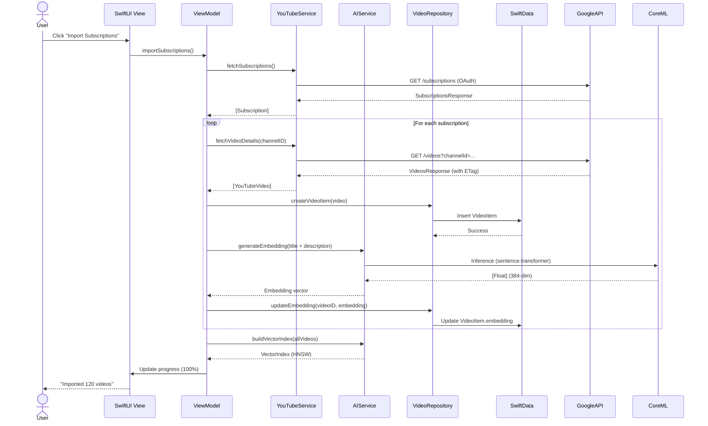
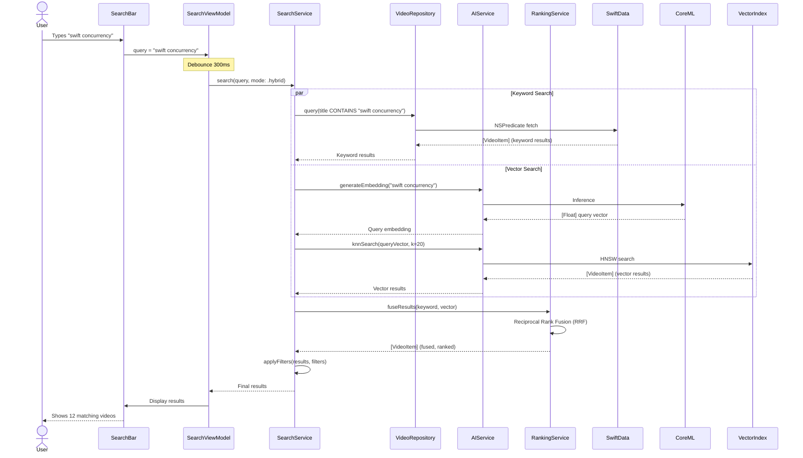
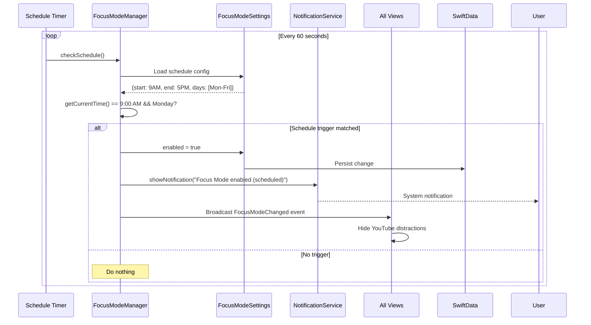

# Core Workflows

## Workflow 1: YouTube Video Import & Embedding Generation

```mermaid
sequenceDiagram
    actor User
    participant UI as SwiftUI View
    participant VM as ViewModel
    participant YT as YouTubeService
    participant AI as AIService
    participant Store as VideoRepository
    participant DB as SwiftData

    User->>UI: Click "Import Subscriptions"
    UI->>VM: importSubscriptions()
    VM->>YT: fetchSubscriptions()
    YT->>GoogleAPI: GET /subscriptions (OAuth)
    GoogleAPI-->>YT: SubscriptionsResponse
    YT-->>VM: [Subscription]

    loop For each subscription
        VM->>YT: fetchVideoDetails(channelID)
        YT->>GoogleAPI: GET /videos?channelId=...
        GoogleAPI-->>YT: VideosResponse (with ETag)
        YT-->>VM: [YouTubeVideo]

        VM->>Store: createVideoItem(video)
        Store->>DB: Insert VideoItem
        DB-->>Store: Success

        VM->>AI: generateEmbedding(title + description)
        AI->>CoreML: Inference (sentence-transformer)
        CoreML-->>AI: [Float] (384-dim)
        AI-->>VM: Embedding vector

        VM->>Store: updateEmbedding(videoID, embedding)
        Store->>DB: Update VideoItem.embedding
    end

    VM->>AI: buildVectorIndex(allVideos)
    AI-->>VM: VectorIndex (HNSW)

    VM->>UI: Update progress (100%)
    UI-->>User: "Imported 120 videos"
```

---

## Workflow 2: Hybrid Search Query

```mermaid
sequenceDiagram
    actor User
    participant UI as SearchBar
    participant VM as SearchViewModel
    participant Search as SearchService
    participant Store as VideoRepository
    participant AI as AIService
    participant Rank as RankingService

    User->>UI: Types "swift concurrency"
    UI->>VM: query = "swift concurrency"
    Note over VM: Debounce 300ms
    VM->>Search: search(query, mode: .hybrid)

    par Keyword Search
        Search->>Store: query(title CONTAINS "swift concurrency")
        Store->>SwiftData: NSPredicate fetch
        SwiftData-->>Store: [VideoItem] (keyword results)
        Store-->>Search: Keyword results
    and Vector Search
        Search->>AI: generateEmbedding("swift concurrency")
        AI->>CoreML: Inference
        CoreML-->>AI: [Float] query vector
        AI-->>Search: Query embedding
        Search->>AI: knnSearch(queryVector, k=20)
        AI->>VectorIndex: HNSW search
        VectorIndex-->>AI: [VideoItem] (vector results)
        AI-->>Search: Vector results
    end

    Search->>Rank: fuseResults(keyword, vector)
    Rank->>Rank: Reciprocal Rank Fusion (RRF)
    Rank-->>Search: [VideoItem] (fused, ranked)

    Search->>Search: applyFilters(results, filters)
    Search-->>VM: Final results
    VM->>UI: Display results
    UI-->>User: Shows 12 matching videos
```

---

## Workflow 3: Focus Mode Schedule Activation

```mermaid
sequenceDiagram
    participant Timer as Schedule Timer
    participant FM as FocusModeManager
    participant Settings as FocusModeSettings
    participant Notify as NotificationService
    participant UI as All Views

    loop Every 60 seconds
        Timer->>FM: checkSchedule()
        FM->>Settings: Load schedule config
        Settings-->>FM: {start: 9AM, end: 5PM, days: [Mon-Fri]}

        FM->>FM: getCurrentTime() == 9:00 AM && Monday?
        alt Schedule trigger matched
            FM->>Settings: enabled = true
            Settings->>SwiftData: Persist change
            FM->>Notify: showNotification("Focus Mode enabled (scheduled)")
            Notify-->>User: System notification
            FM->>UI: Broadcast FocusModeChanged event
            UI->>UI: Hide YouTube distractions
        else No trigger
            Note over FM: Do nothing
        end
    end
```

---
