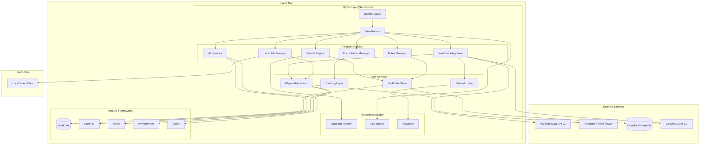

# High Level Architecture

## Technical Summary

MyToob is a **single-process native macOS application** built entirely with Apple's first-party frameworks. The architecture follows a **monolithic design** where all components (UI, data persistence, AI processing, networking) run within the same application sandbox. There is **no custom backend server**—the app communicates directly with YouTube's official APIs for metadata retrieval and embeds the YouTube IFrame Player for compliant video playback. Local video files are managed via AVKit with security-scoped bookmarks for sandbox compliance.

**On-device AI processing** using Core ML generates embeddings from video metadata, builds a vector index for semantic search, and performs graph-based clustering—all without sending data to external servers. SwiftData provides the persistence layer with optional CloudKit sync for cross-device data synchronization. The UI, built entirely in SwiftUI, follows Things 3's clean structural patterns with Reflect's sophisticated purple color palette and glass-morphism visual effects.

**Deployment is simple:** A single signed `.app` bundle distributed via the Mac App Store and/or a notarized DMG for direct download. No infrastructure to manage, no servers to deploy, no databases to administer—everything runs locally on the user's Mac.

## Platform and Infrastructure Choice

**Platform:** macOS 14.0+ (Sonoma or later) - Native application

**Key Services:**
- **YouTube Data API v3** - Metadata retrieval (title, description, thumbnails, channel info)
- **YouTube IFrame Player API** - Embedded video playback (compliant, no stream access)
- **CloudKit** - Optional user data sync across devices (private database only)

**Deployment:**
- **App Store:** Sandboxed `.app` bundle with StoreKit 2 in-app purchases
- **Direct Download:** Notarized DMG with power-user features (local file CV/ASR)

**Regions:** Global (YouTube API available worldwide; CloudKit uses user's iCloud region)

## Repository Structure

**Structure:** Single Xcode project (monorepo for macOS app, no separate frontend/backend)

**Monorepo Tool:** SwiftPM (Swift Package Manager) for dependency management

**Package Organization:**
```
MyToob/
├── MyToob/              # Main app target
│   ├── App/             # App entry point, main views
│   ├── Features/        # Feature modules
│   ├── Core/            # Shared utilities
│   └── Resources/       # Assets, localization
├── MyToobTests/         # Unit tests
├── MyToobUITests/       # UI tests
└── Package.swift        # Dependencies (if any external)
```

**Rationale:** Single Xcode project sufficient for native macOS app. No need for separate frontend/backend repos. SwiftPM handles any external dependencies (minimal—prefer first-party Apple frameworks).

## High Level Architecture Diagram



## Architectural Patterns

- **MVVM (Model-View-ViewModel):** SwiftUI-native pattern for UI state management and business logic separation. _Rationale:_ First-class SwiftUI support with `@Observable` macro, clear separation of concerns, testable ViewModels.

- **Repository Pattern:** Abstract data access behind repository interfaces (e.g., `VideoRepository`, `ClusterRepository`). _Rationale:_ Decouples business logic from SwiftData implementation, enables testing with mock repositories, allows future migration if needed.

- **Service Layer:** Domain services encapsulate complex business logic (e.g., `YouTubeService`, `AIService`, `SearchService`). _Rationale:_ Single responsibility principle, reusable across ViewModels, easier to test in isolation.

- **Dependency Injection:** Constructor injection for services and repositories into ViewModels. _Rationale:_ Explicit dependencies improve testability, SwiftUI environment makes DI natural.

- **Factory Pattern:** Factories for creating complex objects (e.g., `PlayerFactory` creates YouTube or AVKit player based on video source). _Rationale:_ Encapsulates creation logic, allows easy swapping of implementations.

- **Observer Pattern:** Combine publishers for reactive data flows (e.g., search query → debounced → hybrid search → results). _Rationale:_ Native to Swift/SwiftUI, handles async streams elegantly.

- **Strategy Pattern:** Pluggable strategies for search (keyword, vector, hybrid), clustering algorithms, ranking models. _Rationale:_ Flexibility to swap algorithms (e.g., A/B test different ranking models), clean interfaces.

- **Singleton Pattern (Sparingly):** Only for truly global resources like `AppConfiguration`, `LoggingService`. _Rationale:_ Necessary for app-wide state, but minimize use to avoid hidden dependencies.

---
