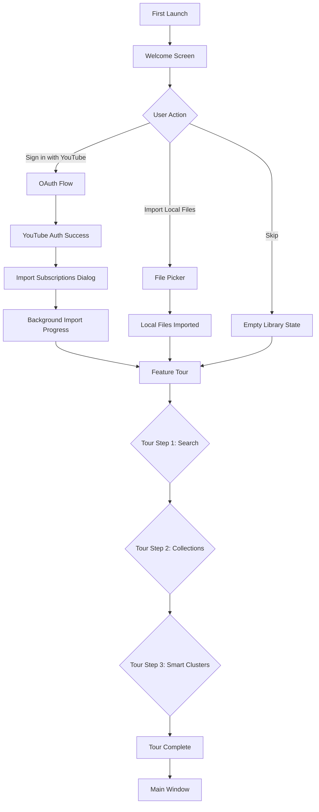
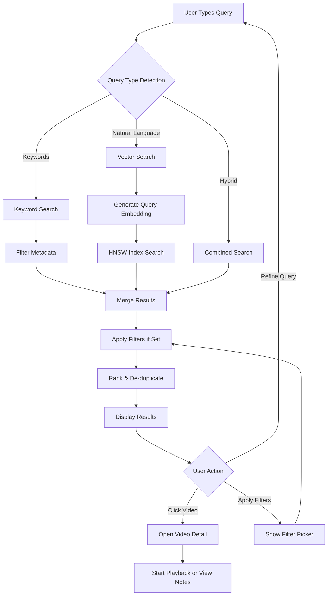
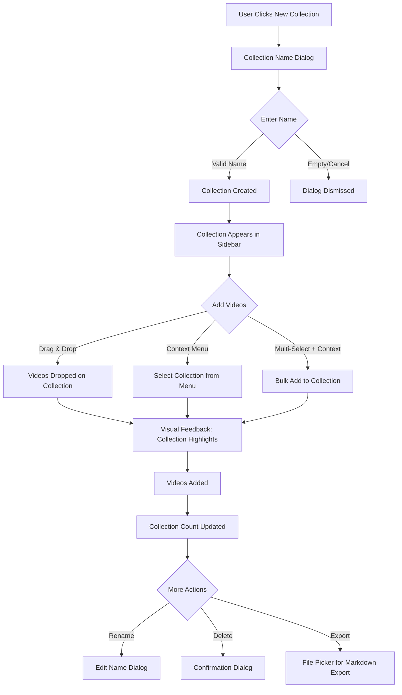
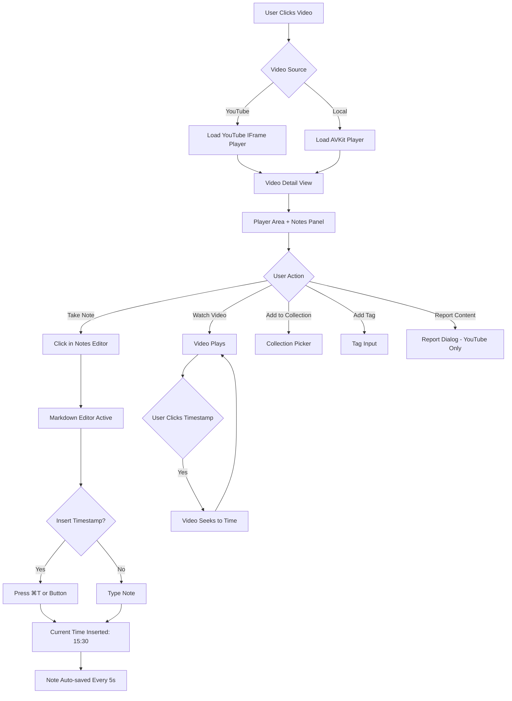
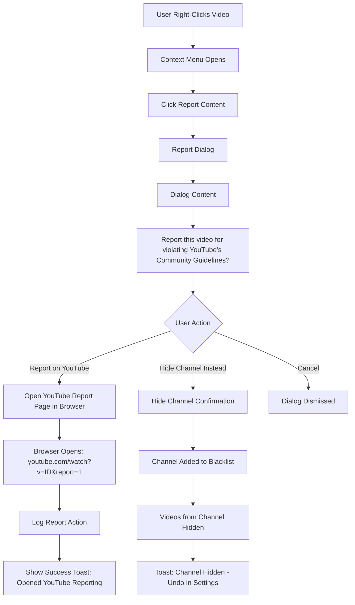

# MyToob UI/UX Specification

## Introduction

This document defines the user experience goals, information architecture, user flows, and visual design specifications for MyToob's macOS native user interface. It serves as the foundation for SwiftUI implementation and frontend development, ensuring a cohesive, Mac-native, and user-centered experience.

MyToob is a native macOS application built with SwiftUI that combines YouTube integration (via official IFrame Player) and local video file management with on-device AI-powered organization. The UI must feel instantly familiar to Mac users while introducing intelligent features (semantic search, clustering, research tools) that enhance productivity without overwhelming casual users.

### Overall UX Goals & Principles

#### Target User Personas

**1. Researcher / Knowledge Worker**
- **Demographics:** Graduate students, academics, content creators, professional learners (age 25-45)
- **Tech Proficiency:** High (comfortable with macOS,

 command-line tools, keyboard shortcuts)
- **Goals:** Organize video research, quickly find previously watched content, take structured notes, build knowledge bases
- **Pain Points:** Juggling multiple tools (YouTube, Notion, playlists), difficult to relocate videos, no semantic search
- **Key Needs:** AI-powered organization, timestamp notes, collection export, deep search

**2. YouTube Power User**
- **Demographics:** Active YouTube subscribers following 50+ channels, heavy playlist users
- **Tech Proficiency:** Medium to high (comfortable with native apps, browser extensions)
- **Goals:** Better organize subscription content, discover connections across channels, manage watch progress
- **Pain Points:** YouTube's web UI limited, playlists manual and tedious, hard to find older subscription videos
- **Key Needs:** Auto-clustering by topic, fast search, unified view of subscriptions

**3. Local Media Enthusiast**
- **Demographics:** Users with large local video collections (courses, screencasts, personal videos)
- **Tech Proficiency:** Medium (uses VLC/IINA, manages files in Finder)
- **Goals:** Organize local library intelligently, combine with YouTube content, apply AI tagging
- **Pain Points:** Existing players lack organization, no way to tag/cluster local videos, disconnected tools
- **Key Needs:** Unified YouTube + local interface, AI organization for local files, metadata extraction

#### Usability Goals

1. **Immediate Familiarity:** Mac users can navigate the app within 30 seconds without tutorials (leverages standard macOS patterns)
2. **Fast Search:** Users can find any video in their library in <5 seconds (prominent search bar, instant results)
3. **Effortless Organization:** AI auto-clustering provides value without manual curation (smart collections appear automatically)
4. **Progressive Disclosure:** Basic features (playback, browsing) obvious, advanced features (research tools, clustering refinement) discoverable through use
5. **Keyboard Efficiency:** Power users can complete all tasks via keyboard (comprehensive shortcuts, command palette)
6. **Error Prevention:** Destructive actions (delete, report) require confirmation; recoverable actions (hide channel) easily reversible

#### Design Principles

1. **Mac-Native First** - Follow Apple Human Interface Guidelines (HIG) religiously; feel like a built-in macOS app, not a web app wrapper
2. **Content Over Chrome** - Maximize video/content visibility; minimize unnecessary UI decoration
3. **Intelligent by Default** - AI features work transparently without configuration (embeddings generate automatically, clusters appear naturally)
4. **Fast & Fluid** - Every interaction instant (<100ms response); smooth 60 FPS animations; no janky loading
5. **Privacy-Transparent** - Communicate on-device processing clearly; user controls data sync; no hidden data collection
6. **Compliance-Conscious** - YouTube player/branding never obscured; UGC controls always accessible; clear disclaimers

### Change Log

| Date | Version | Description | Author |
|------|---------|-------------|--------|
| 2025-11-17 | 1.0 | Initial UI/UX specification created | BMad Master |
| 2025-11-17 | 1.1 | Updated color palette with Reflect-inspired design (deep purples, glass-morphism), added Focus Mode settings screen | BMad Master |

---

## Information Architecture (IA)

### Site Map / Screen Inventory

```mermaid
graph TD
    A[Main Window] --> B[Sidebar]
    A --> C[Content Area]
    A --> D[Player View]
    A --> E[Toolbar]

    B --> B1[Collections]
    B --> B2[Smart Collections / Clusters]
    B --> B3[YouTube Section]
    B --> B4[Local Files]

    B3 --> B3A[Subscriptions]
    B3 --> B3B[Playlists]
    B3 --> B3C[Watch History]

    B4 --> B4A[All Local Videos]
    B4 --> B4B[Recent]

    C --> C1[Grid View]
    C --> C2[List View]
    C --> C3[Search Results]
    C --> C4[Collection Detail]
    C --> C5[Empty States]

    D --> D1[YouTube IFrame Player]
    D --> D2[AVKit Local Player]
    D --> D3[Player Controls Overlay]
    D --> D4[Notes Panel]
    D --> D5[Metadata Panel]

    E --> E1[Search Bar]
    E --> E2[View Toggles]
    E --> E3[Sync Status]
    E --> E4[Pro Upgrade Button]

    A --> F[Settings Window]
    F --> F1[General]
    F --> F2[YouTube Account]
    F --> F3[AI & Privacy]
    F --> F4[Accessibility]
    F --> F5[Advanced]

    A --> G[Onboarding Flow]
    G --> G1[Welcome Screen]
    G --> G2[OAuth Sign-In]
    G --> G3[Feature Tour]

    A --> H[Context Menus]
    H --> H1[Video Context Menu]
    H --> H2[Collection Context Menu]
    H --> H3[Cluster Context Menu]

    A --> I[Modals & Sheets]
    I --> I1[New Collection]
    I --> I2[Report Content]
    I --> I3[Pro Upgrade Paywall]
    I --> I4[Filter Picker]

    A --> J[Command Palette]
    A --> K[Menu Bar Mini-Controller]
```

### Navigation Structure

**Primary Navigation (Sidebar):**
- **Collections Section:** User-created folders for manual organization (always visible, collapsible)
- **Smart Collections Section:** AI-generated topic clusters (Pro feature, collapsible)
- **YouTube Section:** Subscriptions, playlists, watch history (collapsible, only shown if authenticated)
- **Local Files Section:** All local videos, recent (collapsible, shown if any local files imported)

**Secondary Navigation (Toolbar):**
- **Search Bar:** Global search across all videos (always visible, spotlight-style)
- **View Toggles:** Grid vs. List view (icon buttons)
- **Sync Status Indicator:** CloudKit sync state (icon with optional text)
- **Pro Upgrade Button:** Persistent CTA for free users (hidden for Pro users)

**Breadcrumb Strategy:**
- Breadcrumbs shown in content area header when navigating into collections/clusters
- Format: "YouTube > Subscriptions > Channel Name" or "Collections > Swift Tutorials"
- Breadcrumbs clickable for quick back-navigation
- Not used for flat views (Library, Search Results)

**Contextual Navigation:**
- Right-click context menus on all interactive elements (videos, collections, clusters)
- Keyboard shortcuts for all primary actions (see Accessibility section)
- Command Palette (⌘K) for action-based navigation
- Drag-and-drop between sections (videos → collections)

---

## User Flows

### Flow 1: First-Time User Onboarding

**User Goal:** Set up the app and understand key features

**Entry Points:** First app launch after installation

**Success Criteria:** User completes OAuth sign-in (if desired) and understands how to import videos and search

#### Flow Diagram

#### Edge Cases & Error Handling:
- OAuth failure (network down, user cancels) → Show "Try Again" or "Skip for Now"
- No YouTube account → Emphasize local file option
- File picker cancelled → Return to welcome, allow retry
- Tour dismissed early → Save progress, allow re-trigger from Help menu

**Notes:** Onboarding should be **skippable** (not mandatory). Users who import large libraries will see embedding generation progress post-onboarding (non-blocking background task).

---

### Flow 2: Search for Videos (Hybrid Search)

**User Goal:** Find specific videos using keywords or natural language

**Entry Points:** Search bar in toolbar (⌘F), Command Palette (⌘K → "Search")

**Success Criteria:** User finds relevant video in top-5 results, opens video detail or starts playback

#### Flow Diagram

#### Edge Cases & Error Handling:
- Empty query → Show recent videos or popular clusters
- No results → "Try different keywords or remove filters" message
- Search latency >200ms → Show loading spinner (shouldn't happen often given 50ms target)
- Filter applied with zero results → Suggest removing filters

**Notes:** Search is **instant** (debounced 300ms after typing stops). Filter pills shown below search bar when query active. Search mode toggle (Keyword/Semantic/Hybrid) available in Settings for power users.

---

### Flow 3: Create Collection & Add Videos

**User Goal:** Organize videos into a custom collection

**Entry Points:** "New Collection" button in sidebar, drag videos to "+" drop zone

**Success Criteria:** Collection created, videos added, collection visible in sidebar

#### Flow Diagram

#### Edge Cases & Error Handling:
- Duplicate collection name → Show error: "Collection name already exists"
- Drag invalid item (non-video) → Drop rejected, visual feedback (red X)
- Add video already in collection → Silently succeed (no duplicate, no error)
- Delete collection with videos → Confirm: "Videos will not be deleted, only removed from collection"

**Notes:** Collections support **nested structure** (optional, post-MVP). Drag-and-drop provides immediate visual feedback (green highlight on valid drop, red on invalid).

---

### Flow 4: Watch Video with Notes

**User Goal:** Watch video and take timestamp-based notes

**Entry Points:** Click video thumbnail from library/search/collection

**Success Criteria:** Video plays, notes saved automatically, user can jump to timestamp

#### Flow Diagram

#### Edge Cases & Error Handling:
- Video unavailable (404, removed, private) → Show error: "Video unavailable. Open in YouTube?"
- Player fails to load → Show retry button, fallback to YouTube direct link
- Note editor crash → Auto-save recovers last state (5s intervals)
- Timestamp clicked when video not loaded → Load video first, then seek

**Notes:** Notes panel is **resizable** and **collapsible** (user preference saved). Supports full Markdown formatting with live preview toggle.

---

### Flow 5: Report Inappropriate Content (UGC Safeguard)

**User Goal:** Report YouTube video violating community guidelines

**Entry Points:** Right-click video → "Report Content", video detail view → Report button

**Success Criteria:** User understands how to report, YouTube reporting page opens, action logged

#### Flow Diagram

#### Edge Cases & Error Handling:
- Local file selected → Report action not available (YouTube only)
- Browser fails to open → Show error: "Could not open browser. Visit YouTube manually."
- Hide channel fails (DB error) → Show error: "Failed to hide channel. Try again."
- User reports many videos → No rate limiting (logging only, no blocking)

**Notes:** Report action **always opens YouTube's official reporting flow** (no in-app reporting). Action logged for compliance audit. Hidden channels manageable in Settings > Hidden Channels.

---

## Wireframes & Mockups

### Primary Design Files

**Design Tool:** Figma (or low-fidelity ASCII wireframes below for developer reference)

**Figma Link:** *(To be created - placeholder for production design files)*

For this specification, key screen layouts are described in detail below to guide SwiftUI implementation. Final visual designs with exact spacing, colors, and states will be created in Figma post-approval.

---

### Key Screen Layouts

#### Screen 1: Main Window (Library View)

**Purpose:** Primary interface for browsing all videos; entry point for search, collections, playback

**Key Elements:**
- **Toolbar (Top):**
  - Search bar (prominent, 60% width, spotlight-style with magnifying glass icon)
  - View toggle buttons (Grid | List, SF Symbols: square.grid.2x2, list.bullet)
  - Sync status indicator (cloud icon with checkmark/spinner/error state)
  - Pro upgrade button (free users only, "Upgrade to Pro" text + sparkles icon)

- **Sidebar (Left, 240px wide, resizable 180-360px):**
  - **Collections Section:**
    - "Collections" header with "+" button (new collection)
    - List of user collections (folder icon, name, count)
  - **Smart Collections Section (Pro):**
    - "Smart Collections" header with sparkles icon
    - Auto-generated clusters (AI icon, label, count)
  - **YouTube Section (if authenticated):**
    - "YouTube" header with YouTube logo
    - Subscriptions, Playlists, Watch History (expandable)
  - **Local Files Section (if files imported):**
    - "Local Files" header with filmstrip icon
    - All Videos, Recent

- **Content Area (Center, flexible width):**
  - Breadcrumb navigation (if in subcategory): "YouTube > Subscriptions > SwiftUI Lab"
  - Video grid (3-5 columns depending on window width):
    - Thumbnail (16:9 aspect ratio, high quality)
    - Title (2 lines max, ellipsis if longer)
    - Channel/source (1 line, gray text)
    - Duration badge (bottom-right of thumbnail)
    - Progress bar (if watch progress >0%, green bar at bottom)
    - Source badge (top-left: YouTube icon or "Local" text)
  - Or video list (if list view selected):
    - Thumbnail (smaller, 16:9)
    - Title, Channel, Duration, Date Added (columns)
    - Hover actions: Play, Add to Collection, More (...)

**Interaction Notes:**
- Hover on thumbnail shows quick actions overlay (Play, Add to Collection icons)
- Double-click thumbnail starts playback
- Right-click anywhere on video item shows context menu
- Sidebar items draggable (reorder collections)
- Sidebar sections collapsible (disclosure triangles)

**Design File Reference:** *(Figma frame: Main Window - Library View)*

---

#### Screen 2: Video Detail / Player View

**Purpose:** Full-screen video playback with integrated notes, metadata, and actions

**Key Elements:**
- **Player Area (Top, 60% height, 16:9 or content aspect ratio):**
  - **YouTube:** WKWebView embedding IFrame Player (no overlays, YouTube controls visible)
  - **Local:** AVPlayerView with native transport controls (play/pause, scrub, volume, PiP, full-screen)
  - Player controls overlay (macOS-native, auto-hides after 3s inactivity)

- **Metadata Panel (Below or Beside Player, Left, 40% width):**
  - Video title (H2, bold, 2-3 lines max)
  - Channel name (for YouTube, clickable to filter by channel)
  - Duration, Date Added, Watch Progress (small text)
  - AI-suggested tags (chips, clickable to add)
  - Applied tags (chips with X to remove)
  - "Add to Collection" button (dropdown to select collection)
  - "Hide Channel" button (YouTube only, icon)
  - "Report Content" button (YouTube only, flag icon)

- **Notes Panel (Below or Beside Player, Right, 60% width if side-by-side, 100% width if below):**
  - Notes editor header: "Notes" + "New Note" button + "Insert Timestamp" button (⌘T)
  - Markdown editor (plain text with syntax highlighting)
  - Markdown preview toggle (icon button, eye/eye-slash)
  - Note list sidebar (if multiple notes): thumbnails of notes with first line preview
  - Auto-save indicator: "Saved" (gray checkmark, appears 1s after last edit)

- **Related Videos Panel (Bottom, collapsible):**
  - "Related Videos" header with expand/collapse arrow
  - Horizontal scrollable row of thumbnails (same style as library grid)
  - AI-powered recommendations based on vector similarity

**Interaction Notes:**
- Escape key exits player view, returns to library
- Space bar toggles play/pause (when player focused)
- Left/Right arrow keys seek 10s back/forward
- F key toggles full-screen
- ⌘N creates new note
- ⌘T inserts timestamp at current playback position
- Clicking timestamp in note seeks video to that time
- Notes panel resizable by dragging divider
- Notes panel collapsible (user preference saved)

**Design File Reference:** *(Figma frame: Video Detail - Player View)*

---

#### Screen 3: Search Results View

**Purpose:** Display search results with filters and relevance indicators

**Key Elements:**
- **Search Bar (Top, active state):**
  - Query text (editable)
  - Clear button (X icon)
  - Search mode indicator (Hybrid/Keyword/Semantic, small text below bar)

- **Filter Pills (Below Search Bar):**
  - Duration, Date, Source, Topic (chips with dropdown pickers)
  - Active filters shown as dismissible pills with X icon
  - "Clear All Filters" link if multiple filters active

- **Results Count & Sort (Below Filters):**
  - "42 results for 'swift concurrency'" (bold count)
  - Sort dropdown: Relevance (default), Date Added, Duration

- **Results Grid/List (Same layout as Library View):**
  - Highlighted query terms in titles (yellow background)
  - Relevance score badge (optional, Pro feature): "94% match" (small, top-right of thumbnail)
  - Same interaction patterns as library view

- **Empty Results State:**
  - "No results found for 'query'" (large text, centered)
  - Suggestions: "Try different keywords, remove filters, or use semantic search"
  - "Search Mode: Keyword" → "Try Semantic Search" button (if not already using)

**Interaction Notes:**
- Filter pills show picker on click (dropdown or modal sheet)
- Filters applied immediately (no "Apply" button, live filtering)
- Query editable without leaving results view (results update on change)
- Clicking video thumbnail from results opens player view (same as library)

**Design File Reference:** *(Figma frame: Search Results View)*

---

#### Screen 4: Settings Window

**Purpose:** Configure app preferences, manage YouTube account, control AI/sync, view help

**Key Elements:**
- **Sidebar (Left, 180px wide, fixed):**
  - General, YouTube Account, Focus Mode, AI & Privacy, Accessibility, Advanced, About

- **Content Area (Right, 500px wide):**
  - **General Tab:**
    - App appearance (Light/Dark/Auto, system default selected)
    - Default player behavior (auto-play next, auto-pause when minimized)
    - Keyboard shortcuts (view/edit)
  - **YouTube Account Tab:**
    - OAuth status: "Signed in as [email]" or "Not signed in"
    - "Sign Out" button
    - "Import Subscriptions" button
    - API Quota Dashboard (Dev Mode): current usage, limit, reset time
  - **Focus Mode Tab:** *(NEW)*
    - **Focus Mode Status:** ON/OFF toggle (large, prominent)
    - **Presets Section:**
      - Dropdown: Minimal, Moderate, Maximum Focus, Custom
      - Visual preview of what each preset hides (illustrated icons)
      - "Save Current as Preset" button (Pro feature)
    - **Granular Controls:**
      - "Hide YouTube Sidebar" toggle with sub-options (Trending, Recommended)
      - "Hide Related Videos" toggle with "Show from Same Creator" option
      - "Hide Comments" toggle
      - "Hide Homepage Feed" toggle
    - **Scheduling (Pro):**
      - "Enable Schedule" toggle (Pro badge)
      - Time picker: "Active from 9:00 AM to 5:00 PM"
      - Day selector: Weekdays, Weekends, Custom (multi-select)
      - "Sync Schedule Across Devices" toggle
    - **Visual Style:** Glass-morphism panel with purple gradient accent, dark background
  - **AI & Privacy Tab:**
    - CloudKit sync toggle (on/off, status: "Last synced: 2 minutes ago")
    - "Re-generate Embeddings" button (forces re-index)
    - "Clear Cache" button (metadata + thumbnails, not videos)
  - **Accessibility Tab:**
    - VoiceOver: status, "Test VoiceOver Navigation" button
    - Keyboard-only mode: toggle
    - High-contrast theme: toggle
    - Reduce motion: follows system (read-only)
  - **Advanced Tab:**
    - Performance settings: index rebuild frequency, cache limits
    - Diagnostics export: "Export Diagnostics" button
    - Hidden channels list: table with Unhide buttons
  - **About Tab:**
    - App version, build number
    - "Content Policy" link
    - "Support & Contact" link
    - "Not affiliated with YouTube" disclaimer
    - Open-source licenses (if applicable)

**Interaction Notes:**
- Settings window modal (blocks main window while open)
- Changes apply immediately (no "Save" button)
- Dangerous actions (Clear Cache, Sign Out) show confirmation dialog
- Settings accessible via ⌘, (standard macOS shortcut)

**Design File Reference:** *(Figma frame: Settings Window)*

---

#### Screen 5: Command Palette (⌘K)

**Purpose:** Quick action launcher for power users

**Key Elements:**
- **Overlay Modal (Centered, 600px wide, 400px tall):**
  - Search input at top (large, placeholder: "Type a command or search...")
  - Results list below (scrollable):
    - Action icon + action name + keyboard shortcut (right-aligned)
    - Categories separated by headers (Playback, Collections, Search, Settings)
    - Recent actions at top (max 5, dimmed separator)
    - Fuzzy search: "adcol" matches "Add to Collection"
  - Empty state: "No matching commands" (if no results)
  - Footer: Keyboard hints ("↑↓ Navigate, ⏎ Execute, Esc Cancel")

**Interaction Notes:**
- ⌘K opens, Escape closes
- Typing filters actions in real-time
- Up/Down arrows navigate, Enter executes selected action
- Actions execute immediately (palette closes)
- Supports action parameters (e.g., "New Collection: [name]" → shows text input)

**Design File Reference:** *(Figma frame: Command Palette)*

---

## Component Library / Design System

### Design System Approach

**Foundation:** Apple Human Interface Guidelines (HIG) + SF Symbols + macOS design patterns

**Approach:** Leverage SwiftUI's built-in components as much as possible to maintain native feel. Custom components only when standard components lack required functionality (e.g., video grid with hover actions, timeline scrubber with thumbnails).

**Theming:** Support Light and Dark modes (system default), with high-contrast variant for accessibility. Use macOS system colors (accent color follows user's System Preferences).

### Core Components

#### Component: Button

**Purpose:** Primary action trigger (submit forms, execute commands, navigate)

**Variants:**
- **Primary Button:** Filled with accent color, white text (e.g., "Sign In", "Create Collection")
- **Secondary Button:** Bordered with accent color, accent-colored text (e.g., "Cancel", "Skip")
- **Tertiary Button:** Text-only, no border (e.g., "Learn More", "Dismiss")
- **Icon Button:** Icon-only, circular background on hover (e.g., Play, Add to Collection)
- **Destructive Button:** Red filled background, white text (e.g., "Delete", "Sign Out")

**States:**
- Normal, Hover (lighten background 10%), Active (darken 10%), Disabled (50% opacity, no hover), Loading (spinner replaces icon/text)

**Usage Guidelines:**
- Primary button for main action per screen (max one primary)
- Secondary for alternative actions
- Tertiary for low-priority actions
- Icon buttons for toolbar/quick actions
- Always provide keyboard shortcut for primary actions (show in tooltip)

---

#### Component: Video Card

**Purpose:** Display video thumbnail with metadata in grid or list view

**Variants:**
- **Grid Card:** Thumbnail (16:9), title (2 lines), channel (1 line), duration badge, progress bar
- **List Card:** Smaller thumbnail (16:9, 120px wide), title, channel, duration, date added (columns)
- **Compact Card:** Thumbnail only with title overlay (for Related Videos horizontal scroll)

**States:**
- Normal, Hover (scale 1.02, show quick actions overlay), Selected (blue border), Playing (animated border)

**Usage Guidelines:**
- Thumbnail loads lazily (only when visible in scroll view)
- Hover overlay shows 2-3 quick actions (Play, Add to Collection, More)
- Right-click anywhere on card shows context menu
- Double-click starts playback
- Progress bar only shown if watch progress >5%

---

#### Component: Search Bar

**Purpose:** Global search input with instant results

**Variants:**
- **Standard:** Toolbar-embedded, white/dark background, magnifying glass icon left, clear button right
- **Focused:** Expands slightly, shows search mode hint below, drop-shadow for emphasis

**States:**
- Empty (placeholder text: "Search videos..."), Typing (debounced, shows spinner if query >300ms), Results (count shown below), Error (red border if search fails)

**Usage Guidelines:**
- Always visible in toolbar (never hidden)
- ⌘F focuses search bar from any view
- Escape clears query if text present, blurs if empty
- Query history dropdown (down arrow, optional Pro feature)

---

#### Component: Collection Sidebar Item

**Purpose:** Represent collection/cluster in sidebar navigation

**Variants:**
- **User Collection:** Folder icon, editable name, count badge, reorderable
- **Smart Collection:** Sparkles icon, auto-generated name, count badge, Pro badge
- **YouTube Section:** YouTube logo, collapsible, shows subscriptions/playlists

**States:**
- Normal, Hover (background lighten), Selected (accent color background), Dragging (semi-transparent, follows cursor), Drop Target (green highlight)

**Usage Guidelines:**
- Click selects, loads videos in content area
- Right-click shows context menu (Rename, Delete, Export)
- Drag videos onto item to add to collection
- Disclosure triangle for expandable sections (YouTube, Subscriptions)

---

#### Component: Filter Pill

**Purpose:** Show active search filter, dismissible

**Variants:**
- **Active Filter:** Colored background (light gray), filter name + value, X icon
- **Filter Button:** Adds new filter (no X icon, plus icon)

**States:**
- Normal, Hover (darken background), Disabled (if filter invalid)

**Usage Guidelines:**
- Clicking pill opens filter picker (dropdown or sheet)
- Clicking X removes filter immediately
- Multiple pills stack horizontally (wrap to next line if overflow)
- "Clear All" link shown if 2+ active filters

---

#### Component: Markdown Editor

**Purpose:** Rich text note editor with Markdown syntax and live preview

**Variants:**
- **Edit Mode:** Monospace font (SF Mono), syntax highlighting, line numbers optional
- **Preview Mode:** Rendered HTML from Markdown, web fonts (SF Pro), styled headers/lists/code blocks

**States:**
- Editing (cursor visible, toolbar active), Preview (read-only, clickable links/timestamps), Auto-saving (checkmark icon, brief flash)

**Usage Guidelines:**
- Toggle between Edit and Preview with eye icon button
- Toolbar provides: Bold, Italic, Heading, List, Code, Insert Timestamp
- Timestamps rendered as clickable links in preview (seeks video)
- Auto-save every 5 seconds, manual save with ⌘S

---

## Branding & Style Guide

### Visual Identity

**Brand Guidelines:** MyToob brand emphasizes intelligence, privacy, and Mac-native quality. Visual language borrows from macOS system design (clean, minimal, functional) with subtle AI-themed accents (gradients, sparkles for smart features).

**Key Brand Attributes:**
- **Intelligent:** AI-powered features front and center (Smart Collections, semantic search)
- **Private:** On-device processing emphasized (green checkmarks, local badges)
- **Native:** Feels like a Mac system app (SF fonts, system colors, HIG patterns)
- **Trustworthy:** Compliance-conscious (YouTube branding respected, disclaimers clear)

### Color Palette

**Design Philosophy:** Inspired by Reflect's sophisticated dark-first palette with deep purples and luminous accents, combined with Things 3's clean, minimal structure. Dark mode is the primary theme with a refined light mode alternative.

#### Dark Mode (Primary Theme)

| Color Type | Hex Code | Usage |
|------------|----------|--------|
| **Background (Primary)** | #030014 | Main app background (deep purple-black, Reflect-inspired) |
| **Background (Secondary)** | #0a0520 | Sidebar, panels, elevated surfaces |
| **Background (Tertiary)** | #160a30 | Cards, modals, popovers |
| **Primary Purple** | #713fff | Primary accent (buttons, links, selected states) |
| **Secondary Purple** | #9382ff | Hover states, secondary accents |
| **Tertiary Purple** | #ba9cff | Disabled states, subtle highlights |
| **Cyan Accent** | #2cd9ff | Info, secondary actions, cool accents |
| **Magenta Accent** | #fc72ff | Special features, Pro tier badges |
| **Success** | #34C759 | Positive feedback (synced, saved, cached) |
| **Warning** | #FF9500 | Cautions (quota approaching, network issues) |
| **Error** | #FF3B30 | Errors, destructive actions (delete, report) |
| **Text (Primary)** | #FFFFFF | Primary text, headings (100% opacity) |
| **Text (Secondary)** | #ffffffe6 | Secondary text, metadata (90% opacity) |
| **Text (Tertiary)** | #ffffff99 | Tertiary text, placeholders (60% opacity) |
| **Border (Subtle)** | rgba(255,255,255,0.1) | Dividers, card borders (10% white) |
| **Border (Emphasis)** | rgba(255,255,255,0.2) | Focused borders, emphasized dividers (20% white) |

#### Light Mode (Alternative Theme)

| Color Type | Hex Code | Usage |
|------------|----------|--------|
| **Background (Primary)** | #FFFFFF | Main app background (pure white) |
| **Background (Secondary)** | #F5F5F7 | Sidebar, panels (light gray) |
| **Background (Tertiary)** | #ECECEE | Cards, modals (medium gray) |
| **Primary Purple** | #5B2FD4 | Primary accent (darker purple for contrast) |
| **Secondary Purple** | #7952E6 | Hover states, secondary accents |
| **Tertiary Purple** | #9B7BF2 | Disabled states, subtle highlights |
| **Cyan Accent** | #00A8CC | Info, secondary actions |
| **Magenta Accent** | #D946D9 | Special features, Pro tier |
| **Text (Primary)** | #1D1D1F | Primary text (near-black) |
| **Text (Secondary)** | #6E6E73 | Secondary text (medium gray) |
| **Text (Tertiary)** | #A1A1A6 | Tertiary text (light gray) |
| **Border (Subtle)** | rgba(0,0,0,0.1) | Dividers, card borders |
| **Border (Emphasis)** | rgba(0,0,0,0.2) | Focused borders |

**Special Colors (Both Themes):**
- **YouTube Red:** #FF0000 - Used only for YouTube branding (logo, attribution), never for UI elements
- **Local File Badge:** #2cd9ff (Cyan) - Indicates local file source, contrasts with YouTube red
- **AI/Smart Badge:** Gradient (#713fff → #fc72ff) - Smart Collections, AI features
- **Focus Mode Active:** #713fff with glow effect - Indicates Focus Mode enabled

**Glass-Morphism Effects:**
- **Blur Strength:** 8px-22px backdrop blur for panels, modals, popovers
- **Transparency:** Layered with 8%-32% opacity overlays
- **Glow:** Subtle inset glow (0 0 12px) on elevated surfaces for depth
- **Gradients:** Linear 180deg dark-to-transparent purple overlays for atmospheric lighting

### Typography

#### Font Families

- **Primary:** SF Pro (macOS system font, variable weight)
- **Secondary:** SF Pro Rounded (optional, for friendly UI elements like onboarding)
- **Monospace:** SF Mono (code blocks, diagnostics, note editor)

#### Type Scale

| Element | Size | Weight | Line Height |
|---------|------|--------|-------------|
| **H1** | 28pt | Bold (700) | 34pt |
| **H2** | 22pt | Semibold (600) | 28pt |
| **H3** | 18pt | Semibold (600) | 24pt |
| **Body** | 13pt | Regular (400) | 18pt |
| **Small** | 11pt | Regular (400) | 14pt |
| **Caption** | 10pt | Regular (400) | 12pt |
| **Button** | 13pt | Medium (500) | Single line |

**Typography Guidelines:**
- Use SF Pro Text (<20pt) and SF Pro Display (≥20pt) automatically via SwiftUI
- Respect user's text size preferences (Dynamic Type)
- Body text: 13pt is macOS standard (larger than iOS 17pt for desktop viewing distance)
- Line height: 1.4x font size for readability
- Paragraph spacing: 1.2x line height

### Iconography

**Icon Library:** SF Symbols 5+ (macOS 14+), supplemented with custom icons only when necessary

**Usage Guidelines:**
- Use SF Symbols wherever possible (e.g., play.fill, folder, magnifyingglass, sparkles)
- Icon sizing: Small (16pt), Medium (20pt), Large (24pt), Hero (48pt+)
- Icon weights: Match text weight in context (Regular for body text, Semibold for headers)
- Color: Monochrome (inherit text color) or accent color for primary actions
- Custom icons: Only for brand-specific elements (app icon, unique features not in SF Symbols)

**Key Icons:**
- **Play:** play.circle.fill (primary action on video cards)
- **Collections:** folder.fill (user collections)
- **Smart Collections:** sparkles (AI-generated clusters)
- **YouTube:** Custom YouTube logo (official asset)
- **Local Files:** film.stack (local video source)
- **Search:** magnifyingglass
- **Settings:** gear
- **Add:** plus.circle
- **Report:** flag.fill
- **Notes:** note.text
- **Sync:** icloud.and.arrow.up.down

### Spacing & Layout

**Grid System:** 8pt base grid (all spacing multiples of 8: 8, 16, 24, 32, 40, 48...)

**Spacing Scale:**
- **XXS:** 4pt (tight spacing, icon-text gaps)
- **XS:** 8pt (inline elements, button padding)
- **SM:** 16pt (between related elements, card padding)
- **MD:** 24pt (between sections, content margins)
- **LG:** 32pt (between major sections, modal padding)
- **XL:** 48pt (hero spacing, onboarding screens)

**Layout Guidelines:**
- **Content margins:** 24pt from window edges
- **Sidebar width:** 240pt default (resizable 180-360pt)
- **Toolbar height:** 52pt (macOS standard)
- **Button min height:** 32pt (44pt for touch targets if macOS Catalyst/iOS in future)
- **Card padding:** 16pt internal padding
- **Grid gaps:** 16pt between cards (horizontal and vertical)

---

## Accessibility Requirements

### Compliance Target

**Standard:** WCAG 2.1 Level AA + macOS Accessibility Guidelines (VoiceOver, Keyboard Access, ReducedMotion)

### Key Requirements

**Visual:**
- **Color contrast ratios:**
  - Normal text (13pt): 4.5:1 minimum (body text on background)
  - Large text (≥18pt or ≥14pt bold): 3:1 minimum (headers, buttons)
  - UI components (borders, icons): 3:1 minimum
- **Focus indicators:**
  - Visible blue ring (system accent color) around focused element
  - 2pt stroke width minimum
  - Never remove focus indicators (anti-pattern for accessibility)
- **Text sizing:**
  - Support Dynamic Type (text scales with user's Accessibility settings)
  - Test at 200% zoom (command + "+")
  - Never use fixed-size text (always use relative units)

**Interaction:**
- **Keyboard navigation:**
  - Tab key moves focus through all interactive elements
  - Shift+Tab moves backwards
  - Enter/Space activates buttons
  - Arrow keys navigate lists/grids
  - Escape dismisses modals, cancels actions
  - All features accessible via keyboard (no mouse-only interactions)
- **Screen reader support (VoiceOver):**
  - All buttons/links have descriptive labels (not "Button", use "Play video: [title]")
  - Images have alt text (thumbnails: "Video thumbnail: [title]")
  - Form fields have associated labels
  - Dynamic content changes announced ("Search returned 12 results")
  - ARIA roles for custom components (if bypassing SwiftUI defaults)
- **Touch targets:**
  - Minimum 44pt x 44pt for clickable elements (macOS recommended, iOS required)
  - Current desktop target: 32pt (acceptable for mouse/trackpad, increase for touch screens)

**Content:**
- **Alternative text:**
  - All images: descriptive alt text (thumbnails include video title)
  - Icons: either labeled or decorative (no alt text if redundant with adjacent label)
- **Heading structure:**
  - Logical hierarchy (H1 → H2 → H3, no skipping levels)
  - One H1 per view (screen title)
- **Form labels:**
  - All input fields have visible labels (not just placeholder text)
  - Error messages associated with form fields (announced by VoiceOver)

### Testing Strategy

1. **Automated Testing:**
   - Xcode Accessibility Inspector: run before each release
   - Contrast checker: verify all color combinations meet WCAG AA
   - SwiftUI Accessibility Audit: built-in warnings in Xcode

2. **Manual Testing:**
   - VoiceOver testing: navigate entire app with screen reader (recruit blind users for beta)
   - Keyboard-only testing: unplug mouse, complete all user workflows
   - Reduced motion testing: enable in System Preferences, verify no broken animations
   - High-contrast testing: enable in System Preferences, verify readability

3. **User Testing:**
   - Recruit accessibility users for TestFlight beta (5-10 users minimum)
   - Collect feedback on VoiceOver experience, keyboard navigation, visual clarity
   - Iterate based on feedback before App Store submission

---

## Responsiveness Strategy

### Breakpoints

*Note: macOS window sizes are flexible (user-resizable), unlike fixed mobile breakpoints. These are guidelines for optimal layout adaptation.*

| Breakpoint | Min Width | Max Width | Target Devices | Layout Adaptation |
|------------|-----------|-----------|----------------|-------------------|
| **Compact** | 800px | 1024px | Small MacBook screens (13" MacBook Air) | Sidebar collapsed to icons only, 2-column grid |
| **Regular** | 1025px | 1440px | Standard MacBook/iMac (13-15" MacBook Pro, 21" iMac) | Default layout: visible sidebar, 3-column grid |
| **Wide** | 1441px | 1920px | Large iMac, external displays (24-27" iMac, 1080p displays) | 4-column grid, wider content margins |
| **Ultra-Wide** | 1921px | - | 5K iMac, 4K/6K external displays (27" iMac, Pro Display XDR) | 5+ column grid, split-view player+notes side-by-side |

### Adaptation Patterns

**Layout Changes:**
- **Compact:** Sidebar auto-collapses to icon-only mode (hover expands temporarily), grid reduces to 2 columns, filter pills stack vertically
- **Regular:** Default layout, sidebar visible, 3-column grid, all features accessible
- **Wide:** Grid expands to 4 columns, content margins increase (better use of space), notes panel can be side-by-side with player
- **Ultra-Wide:** Grid 5+ columns or split-screen mode (library + player simultaneously), multi-pane layout (sidebar + content + player + notes)

**Navigation Changes:**
- **Compact:** Hamburger menu for sidebar (instead of always-visible sidebar)
- **Regular+:** Persistent sidebar, no hamburger

**Content Priority:**
- **Compact:** Hide secondary metadata (date added, file size), show only title + channel
- **Regular+:** Show all metadata

**Interaction Changes:**
- **Compact:** Context menus replace hover actions (no hover state on small screens)
- **Regular+:** Hover actions shown, context menus still available

---

## Animation & Micro-interactions

### Motion Principles

1. **Purposeful:** Animations serve functional purpose (guide attention, provide feedback, show relationships)
2. **Fast:** Animations complete in 100-300ms (feel instant, not sluggish)
3. **Natural:** Use ease-in-out easing (accelerate at start, decelerate at end) to mimic physical motion
4. **Respectful:** Honor macOS Reduced Motion preference (disable non-essential animations)
5. **Performant:** Maintain 60 FPS (avoid janky animations that harm UX)

### Key Animations

- **View Transitions:** Fade + slide (300ms, ease-in-out) when navigating between library/search/collections
- **Modal Appearance:** Scale + fade (200ms, spring curve) for dialogs and sheets
- **Hover Effects:** Scale thumbnail 1.02x (150ms, ease-out) on hover, show quick actions overlay with fade (100ms)
- **Loading Spinners:** Continuous rotation (1s per rotation, linear easing) for indeterminate progress
- **Progress Bars:** Animate width change (200ms, ease-in-out) when watch progress updates
- **Toast Notifications:** Slide up from bottom (250ms, spring), auto-dismiss after 3s with fade-out (200ms)
- **Drag & Drop:** Semi-transparent ghost follows cursor (0ms delay, immediate feedback), drop target highlights with pulse (150ms, ease-in-out)
- **Search Results:** Fade-in new results (150ms, staggered 20ms delay per item) for smooth appearance

**Reduced Motion Adaptations:**
- Replace scale/slide with simple fade (100ms)
- Remove spring curves (use linear ease-in-out)
- Disable continuous animations (spinners remain, but simplified)

---

## Performance Considerations

### Performance Goals

- **Cold Start (App Launch):** <2 seconds from click to first render (including SwiftData load, no network calls)
- **Warm Start (Reactivate):** <500ms from backgrounded to responsive
- **Search Query Response:** <50ms P95 latency (in-memory index, no network)
- **Page Scroll:** 60 FPS (no dropped frames during grid scroll with 100+ thumbnails)
- **Animation FPS:** 60 FPS for all transitions and micro-interactions
- **Memory Usage:** <500MB resident for 10,000-video library (including thumbnail cache)

### Design Strategies

**Lazy Loading:**
- Grid thumbnails load only when visible in viewport (SwiftUI LazyVGrid)
- Metadata fetched on-demand (not all 10k videos loaded at launch)
- Notes panel content loaded only when video detail view opened

**Image Optimization:**
- Thumbnails cached at 2 sizes: grid size (320x180) and detail size (640x360)
- Use HEIC format where possible (smaller file size, native to macOS)
- Blurred placeholder while loading (instant feedback, prevents layout shift)

**Rendering Optimization:**
- Use SF Symbols instead of custom PNGs (vector, scales without quality loss, smaller size)
- Minimize drop-shadows and blur effects (GPU-intensive)
- Batch updates: update 10 grid items at once, not one-by-one (reduces layout passes)

**Data Fetching:**
- Prefetch next page of results when scrolling approaches end (80% scroll position)
- Background index updates (don't block UI thread)
- ETag-based caching prevents redundant network calls (95%+ cache hit rate target)

---

## Next Steps

### Immediate Actions

1. **Review & Approve UI/UX Spec:** Share this document with stakeholders (if applicable) for feedback
2. **Create High-Fidelity Mockups (Optional):** Use Figma to create pixel-perfect designs for key screens if visual design polish required before development
3. **Prototype Key Interactions (Optional):** Use Figma prototyping or SwiftUI previews to test user flows (onboarding, search, playback)
4. **Handoff to Architect:** Provide this spec to Design Architect for technical architecture document (see below)
5. **Accessibility Review:** Share with accessibility experts (if available) to validate compliance strategy

### Design Handoff Checklist

- [x] All user flows documented (onboarding, search, collections, playback, report content)
- [x] Component inventory complete (buttons, video cards, search bar, filter pills, markdown editor)
- [x] Accessibility requirements defined (WCAG AA, VoiceOver, keyboard-only, high-contrast)
- [x] Responsive strategy clear (breakpoints for compact/regular/wide/ultra-wide screens)
- [x] Brand guidelines incorporated (macOS HIG, SF Symbols, system colors, compliance-conscious)
- [x] Performance goals established (<2s cold start, <50ms search, 60 FPS animations)

**Ready for Architecture Phase:** This UI/UX specification provides complete guidance for SwiftUI implementation. The Design Architect can now create the technical architecture document, referencing both the PRD and this spec to define SwiftData models, YouTube/AVKit integration, Core ML pipeline, and component hierarchies.

---

## Checklist Results

*(To be populated after running UX checklist, if available. Placeholder for validation.)*

**Checklist Items:**
- All major screens documented with wireframes or detailed descriptions
- User flows cover happy paths and edge cases
- Accessibility requirements meet or exceed WCAG AA
- Design system components reusable across screens
- Performance goals measurable and achievable
- macOS HIG patterns followed for native feel

**Status:** Ready for Architect Handoff ✅
